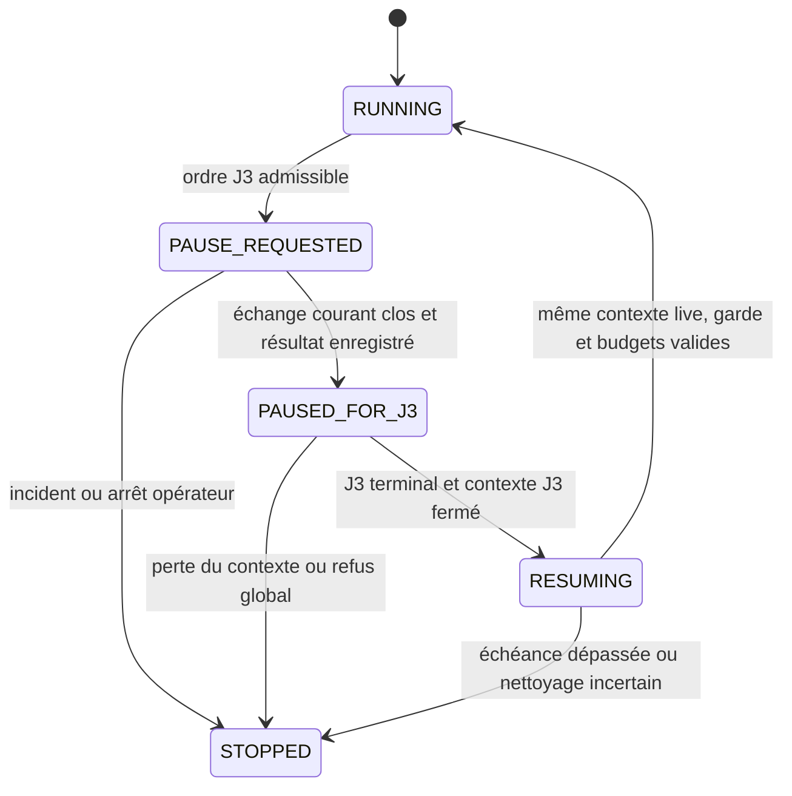

# ADR-SS-007 — Automatisation J3, catalogue durable par date et pause live

- **Version :** 0.2.
- **Statut :** `ACCEPTED_FOR_IMPLEMENTATION` — instruction propriétaire « Commencer l’implémentation du WO-060 » le 13 septembre 2026 ; qualification distincte et en cours.
- **Date :** 2026-09-13.
- **Décideur :** propriétaire du Betting Project.
- **Work Order :** [WO-SS-20260913-060](docs/work_orders/active/WO-SS-20260913-060-j3-automation-and-durable-catalog.md).
- **Base inspectée :** `d4c3d8ceeb6c46442f0792d436a3df7e2630f599`, train `feature/V0.1.0-RC01` vérifié sur GitHub.
- **Portée actuelle :** réalisation du WO-060 autorisée, avec tests hors fournisseur. Le cadrage v0.1 est conservé au commit `9e0d1cb` ; l’instruction de réalisation adopte son périmètre et ses règles techniques. Aucun essai fournisseur ni changement de base opérateur n’est engagé par l’agent.
- **Statuts conservés :** `EXPERIMENTAL`, `LOCAL_ONLY`, `NOT_PRODUCTION_APPROVED`, `NO_CRITICAL_DEPENDENCY`.

## 1. Demande et état établi

**Réalisation au 14 septembre 2026 :** V55 porte les collections/projections et la reprise
historique, V56 les préférences/ordres, V57 live-v11 et les transitions de pause.
Le moteur est raccordé uniquement au serveur Web local disponible ; les commandes de maintenance
ne prennent pas le rôle d'ordonnanceur. Le protocole worker est 10. La façade
`LiveSessionSchedule` isole V11 sans réécrire le bytecode historique `LiveSchedule` ni
les preuves V8/V9. Voir le [guide J3](docs/runbooks/J3-AUTOMATION-AND-DURABLE-CATALOG.md)
et le [rapport de réalisation](docs/validation/WO060-J3-IMPLEMENTATION-20260914.md).
Les constats de base et formulations prospectives qui suivent décrivent le contrat adopté au cadrage.

Le propriétaire demande une collecte quotidienne J3 configurable dans l’interface, par défaut
pour la date du jour au démarrage, des prochaines collectes à heure déterminée, une commande
d’activation/désactivation persistante, ainsi qu’un parcours manuel réduit à la date et au
bouton de collecte ou à l’import JSON. Le dernier succès de chaque date doit alimenter la
liste déroulante et une nouvelle vue paginée après redémarrage et après collecte d’une autre date.
Une collecte J3 automatique doit suspendre J4 et toutes les familles J5 d’une campagne live,
puis permettre sa reprise.

Deux arbitrages supplémentaires sont **explicitement choisis le 13 septembre 2026** :

| Question | Choix propriétaire |
|---|---|
| Première mise en service | « Activée dès le premier démarrage » ; le choix ultérieur est conservé |
| Horaire programmé pour une date déjà collectée avec succès | « Exécuter les horaires explicitement programmés » ; le manuel reste possible |

Le code de la base inspectée établit les limites suivantes :

- `J3ManualCollectionEvidenceService.latest` ne conserve qu’une preuve en mémoire ; `publish` remplace la précédente, y compris après un échec.
- `J3TournamentCatalogService.latest()` exige cette preuve du processus courant, terminale `COMPLETED`, et relit ses snapshots exacts. Le cache par page ne prouve pas à lui seul une collecte complète.
- `DashboardController` et `TournamentEventDiscoveryControlService` consultent ce catalogue global ; le second ne reçoit pas encore l’identité d’une collecte choisie par date.
- `ManualCallController`, `J3ManualCallControlService` et le formulaire J3 imposent les actions répétées décrites par le propriétaire.
- `ManualProviderRequestCoordinator` garde un verrou lié au thread propriétaire et un garde PostgreSQL pendant toute la campagne live ; une acquisition J3 concurrente est refusée.
- `ChildJvmPlaywrightProviderSupervisor` admet une seule campagne active et `LiveProviderSession` autorise exactement les quatre familles J4/J5. La pause avec J3 n’est pas un comportement existant.
- Le schéma courant est V54. Le ledger J8 conserve des campagnes, unités, résultats et références de snapshots ; sa capacité à reconstruire chaque succès historique devra être contrôlée, sans interroger la base opérateur pendant ce cadrage.

## 2. Portée de la décision proposée

Les choix fonctionnels et règles techniques de la proposition v0.1 constituent le contrat de
réalisation autorisé. Cette v0.2 adopte prospectivement les exceptions J3 de la table suivante ;
les autres règles et les preuves historiques restent en vigueur. Les formulations « proposé »
dans les sections de conception désignent ce contrat adopté, pas une demande de confirmation
supplémentaire. Leur réalisation et leur qualification sont suivies séparément dans le WO.

| Référence courante | Adaptation à adopter pour réaliser WO-060 | Limite conservée |
|---|---|---|
| [ADR-SS-001 v1.4](ADR-SS-001-experimentation-endpoints-sofascore-depuis-windows.md), §§3.4, 3.5, 3.6.1 et 8 | Autorité J3 issue d’un clic direct ou d’un ordre automatique local enregistré ; exception au lancement exclusivement manuel de Playwright pour ces seuls ordres | Même origine et endpoint `SCHEDULED_EVENTS`, appels bornés, aucune extension J4/J5 automatique hors campagne live |
| ADR-SS-001, §§3.8, 3.10 et 9 | Publication durable du résultat J3 et revue de l’extension temporelle | Provenance, séparation brut/normalisé, statut expérimental et local |
| [ADR-SS-005 v0.11](ADR-SS-005-bounded-local-live-j4-j5-campaigns.md) | Pause explicite de toutes les familles live, autorité temporaire J3 dans le runtime propriétaire, reprise sous politique qualifiée | Même campagne, même contexte live, mêmes échéance finale et budgets ; aucune reprise après perte du contexte ou redémarrage |
| [ADR-SS-006 v0.1](ADR-SS-006-j3-manual-pagination-cap-35.md), §2.2 | Étendre les modes de déclenchement et retirer la confirmation d’intention J3 | Pages 1 à 35, terminal `hasNextPage=false`, cache par page, 3 s aux frontières J3, 5 Mio/page et 25 Mio/lot importé |
| [AGENTS.md](AGENTS.md), invariants 3, 11 et 12 | Inscrire l’exception J3 et l’isolation du contexte J3 lors d’une pause live | Pas de navigateur dans les tests standards, aucun profil persistant, cookie ou état transféré entre contextes |
| [Architecture J3 → J5](docs/architecture/J3-J5-TOURNAMENT-EVENT-DISCOVERY.md) | Catalogue identifié par date et collecte durable, sélection serveur liée à cette identité | Filtre métier actuel, identité de phase, contrôle de provenance et action distincte pour découvrir les rencontres |

`ConnectorGate`, le catalogue générique `callable=false`, les défauts J0/J1 et le profil bloqué
`sofascore-live-test` ne deviennent pas des moyens d’accès général. Les propriétés historiques
`automatic-refresh-enabled` et `live-polling-enabled` ne sont pas détournées en interrupteur J3.
Une configuration dédiée sépare le moteur J3 autorisé des anciennes politiques manuelles.

Le nouveau formulaire J3 supprime effectivement les boutons de levée de l’arrêt global et
d’activation du circuit, la préparation, la phrase et la case de confirmation. Le serveur ne
doit pas simplement exécuter ces anciennes actions en secret : le clic ou l’ordre durable
constitue l’autorité J3. La fin d’une collecte J3 ne réapplique plus un arrêt global qui tuerait
une campagne live suspendue. Les autres parcours conservent leurs confirmations propres.

Les protections techniques restent distinctes : requête Web locale protégée contre les envois
croisés, validation des entrées, conservation du brut, sérialisation fournisseur, budgets,
refus persistants 403/429 et nettoyage du transport. Une suspension pour incident fournisseur
ne peut pas être effacée par un clic de collecte, un redémarrage ou un horaire planifié.

## 3. Temps, déclenchements et absence de doublons

### 3.1 Dates et identité

Le fuseau métier proposé est **Europe/Paris**, cohérent avec la découverte actuelle. Chaque
ordre fige séparément `collection_date` (date du calendrier demandé), `scheduled_at` (instant
d’échéance éventuel), `started_at` et `completed_at` en UTC. Passer minuit pendant une collecte
ne change jamais sa date cible. La date d’une réception n’est pas substituée à la date cible.

La règle de démarrage porte sur le succès de la **date cible du jour**, quelle que soit sa voie
d’acquisition, y compris un import local ou une résolution entièrement issue du cache. Une
collecte terminée aujourd’hui pour une autre date ne satisfait pas cette règle. Un succès
historique attesté pour la date cible satisfait aussi la règle après sa reprise durable.
Un terminal historique de succès prouvé dont le contenu n’est plus récupérable garde un marqueur
distinct : il empêche aussi le doublon au démarrage, tout en affichant l’indisponibilité du
catalogue. L’absence de projection récupérable n’annule pas rétroactivement ce succès.

### 3.2 Modes configurables

| Mode | Comportement proposé | Effet d’un succès déjà présent pour la date cible |
|---|---|---|
| Quotidien « au démarrage / changement de jour », défaut | Après disponibilité complète du Lab, demander la date du jour ; si le Lab reste ouvert, une opportunité au changement de jour | Ignorer l’opportunité, sans navigateur ni appel |
| Quotidien « à HH:mm », choisi dans l’interface | Remplace le déclenchement opportuniste par une occurrence à heure locale fixe chaque jour de service | Exécuter cette occurrence explicitement programmée une seule fois |
| Planification ponctuelle | Une ou plusieurs lignes : date du calendrier, date et heure d’exécution ; modifiables ou annulables avant prise en charge | Exécuter chaque occurrence distincte explicitement programmée une seule fois |
| Manuel A | Date choisie ou date du jour, puis clic direct de collecte paginée | Actualisation permise |
| Manuel B | Même date choisie, fichiers contigus, puis clic d’import | Nouveau succès possible, zéro appel et zéro accès au cache fournisseur |

Les deux modes quotidiens sont exclusifs ; les planifications ponctuelles s’y ajoutent.
Dans le mode à heure fixe, démarrer avant l’heure ne collecte pas prématurément et démarrer après
l’heure ne rejoue pas une occurrence manquée. Le choix d’un horaire reste ainsi effectif.

La préférence persistante est initialisée à **activée**, avec le mode au démarrage, une seule
fois lors de la mise en service. La migration ne lance aucun navigateur. Le contrôle de démarrage
attend migrations, accès au stockage et réconciliation locale des opérations interrompues.
Un Lab déjà configuré pour l’option A n’exige aucun nouveau geste préalable. Si le runtime
Playwright, l’origine exacte, l’allowlist ou la capacité locale requise sont absents, l’interface
affiche « automatisation activée, exécution indisponible » et la cause ; aucune ouverture n’est
tentée. Les tests et les profils non opérateur ne créent jamais d’ordre fournisseur par défaut.

### 3.3 Identité des occurrences et conflits

- Une opportunité quotidienne possède une clé unique par date civile et date cible. **Proposition de borne : une seule tentative opportuniste par jour**, persistante même en cas d’échec ; les redémarrages ne forment pas une boucle de retry. Le manuel et les horaires explicites restent disponibles.
- Une occurrence programmée porte l’identité et la révision de sa règle, son échéance UTC et sa date cible. Sa consommation est unique. Deux ticks, deux requêtes HTTP ou deux instances ne doublent pas son exécution.
- Un horaire explicitement programmé n’est pas annulé parce qu’un manuel vient de réussir. Il est exécuté ensuite si nécessaire ; son dernier succès devient celui de cette date.
- Si un horaire explicite et une opportunité quotidienne sont admissibles ensemble pour la même date, l’horaire a priorité ; l’opportunité attend son résultat puis revérifie le succès. Un succès la fait ignorer, un échec ne crée pas de retry compensateur à cette même échéance.
- Un ordre opportuniste déjà en attente revérifie le succès après obtention du droit d’exécuter. Un succès manuel intervenu entre-temps supprime son départ. La vérification et l’admission doivent partager une frontière atomique.
- Un seul ordre J3 s’exécute à la fois, toutes voies confondues. Des ordres distincts sont servis par échéance puis identifiant stable ; proposition de borne : 100 occurrences ponctuelles futures ou en attente, avec expiration explicite. Une occurrence fixe est prise en charge au premier passage admissible après son échéance seulement si le Lab est resté en service depuis cette échéance. Les doublons exacts de planification sont refusés dans l’interface.
- Un double clic manuel réutilise une même clé d’idempotence serveur. Un nouveau clic volontaire après un résultat peut créer une autre collecte.

### 3.4 Absence, arrêt, modification et horloge

Le moteur appartient au processus du Lab. Aucune tâche Windows, automation Codex, relance du Lab,
cron externe ni service sur le VPS n’est créée. Une échéance ponctuelle passée pendant l’arrêt,
la veille ou la désactivation est marquée manquée avec son motif ; elle n’est pas rejouée au
démarrage. En mode par défaut, l’opportunité du jour reste une opération distincte des horaires
manqués. Un retard causé par une collecte active dans un Lab resté en service est visible comme
attente interne, dans la borne de l’ordre, et non comme arrêt du Lab.

La désactivation est persistante et empêche l’admission des ordres automatiques. Les futurs
horaires restent visibles et peuvent être annulés ; ceux qui passent durant la désactivation
sont marqués manqués. **Proposition :** si une collecte automatique est en cours, sa requête
déjà partie termine son échange, puis les pages suivantes sont annulées. Le succès précédent
reste disponible et le live peut reprendre après nettoyage. Le manuel est indépendant du bouton.
La réactivation en mode au démarrage réévalue la date du jour si aucune tentative opportuniste
n’a encore été consommée ; elle n’efface aucun échec déjà enregistré.

Modifier une planification non commencée annule son ancienne révision et crée la suivante.
Une occurrence déjà prise en charge reste immuable. La configuration est verrouillée/versionnée
avec la prise en charge afin qu’une désactivation validée avant admission interdise le départ.

**Règles d’horloge proposées :** conserver le fuseau IANA et l’instant UTC résolu ; refuser une
heure ponctuelle inexistante et faire choisir l’occurrence d’une heure ambiguë avec son offset.
Pour une récurrence, avancer une heure inexistante au premier instant valide et retenir seulement
la première occurrence d’une heure répétée ; l’aperçu des prochaines échéances expose ce choix.
Un changement d’horloge ne recrée aucune occurrence consommée. Une rupture temporelle pendant
une opération fournisseur termine cette opération sans reprise automatique.

## 4. Succès durable et consultation

### 4.1 Critère de succès

Une collecte devient `COMPLETED` uniquement lorsque ses pages exactes 1 à N sont conservées,
parsées et cohérentes, que `hasNextPage=true` précède la seule page terminale `false`, et que
sa projection consultable et sa preuve terminale sont publiées ensemble. N est compris entre
1 et 35 pour les nouvelles collectes. Une page 35 annonçant une suite reste un échec borné,
sans page 36. Zéro tournoi est un succès vide valide, affiché explicitement.

Chaque page garde sa clé date/page, son snapshot, son éventuelle occurrence, son SHA-256,
sa taille, sa version de parseur, son heure de réception et sa source `PROVIDER`, `CACHE` ou
`LOCAL_JSON_IMPORT`. La source d’une page et le déclencheur d’une collecte sont deux dimensions
indépendantes : une collecte automatique peut comporter des pages de cache et fournisseur.
Les modes d’acquisition existants ne sont pas falsifiés pour porter le déclencheur.

Les données normalisées du catalogue restent séparées des octets bruts. Elles conservent toutes
leurs références sources, y compris plusieurs pages pour une même occurrence de tournoi.
Les contradictions entre pages invalident la publication ; aucune liste partielle ne remplace
le dernier succès. Une preuve J3 nouvelle est versionnée : elle indique le déclencheur réel et
ne porte plus systématiquement `POLLING_OR_SCHEDULE_EXECUTED=NO` ou un faux état d’arrêt global.
Les preuves V6 et ledgers historiques restent immuables.

### 4.2 Dernier succès par date

Un pointeur durable `last_success` existe pour chaque date cible. Il est avancé dans la même
transaction que le résultat complet et la projection. Un échec, une annulation, un incident de
publication ou une collecte d’une autre date ne l’efface jamais. La chronologie des tentatives
et le dernier succès sont exposés séparément.

La durée de vie du cache de transport n’expire pas ce pointeur ni le catalogue consultable.
La consultation ne collecte pas, ne rafraîchit pas automatiquement le fournisseur et ne dépend
pas de l’existence d’une session Web précédente. Un succès du 13 reste accessible après un
succès du 14, un redémarrage, puis un retour au 13.

### 4.3 Interface et sélection stable

Le formulaire J3 affiche un champ date commun aux options A et B :

- **A. Lancer la collecte paginée — APPELS FOURNISSEUR** ;
- **5B. Importer et valider J3 — ZÉRO APPEL**, libellé demandé, avec les fichiers `page-1.json` à `page-N.json`.

Un choix de date en lecture seule recharge son dernier succès enregistré. La liste déroulante
conserve les règles actuelles : identité `tournament.id`, libellé nom/catégorie, présence de
`uniqueTournament.id` et filtre des offsets applicables à Europe/Paris pour cette date. Les
comptes de deux offsets lors d’un changement d’heure ne sont pas additionnés artificiellement.

La nouvelle vue paginée présente les tournois de **la même collecte identifiée**, sa date, sa
date de réussite, son déclencheur, ses sources et les motifs d’exclusion des options non
actionnables. Elle ne fabrique pas de rencontres à partir de la liste `scheduled`. Proposition :
25 lignes par page, tailles 25/50/100, maximum 100, tri déterministe avec identité de tournoi
comme dernier discriminant, total et navigation explicites.

Les liens de pagination portent `collectionId`, date et page ; une nouvelle collecte parallèle
ne mélange pas leurs résultats. La page peut signaler un succès plus récent et proposer son
ouverture. La sélection envoyée à la découverte de rencontres porte elle aussi `collectionId`,
date et `tournamentId`, revalidés côté serveur. Un autre onglet ou une collecte à une autre date
ne change pas silencieusement cette sélection. La découverte demeure une action distincte.

Un bloc séparé expose l’automatisation activée/désactivée, le mode quotidien, les prochains
horaires, leurs états et le dernier motif d’échec. Pendant un conflit, il affiche « J3 en attente
de pause live », puis « live en pause pour J3 », puis l’issue de la reprise. La consultation des
résultats reste utilisable pendant ces transitions.

## 5. Persistance proposée

Les noms ci-dessous sont un contrat de conception, pas des migrations créées par ce lot.
Les migrations de réalisation seront append-only à partir du schéma réellement courant ;
**V54 est la base inspectée, pas une réservation du prochain numéro**.

| Ensemble durable proposé | Données et contraintes principales |
|---|---|
| `j3_automation_settings` | Singleton local : activé, mode quotidien, heure éventuelle, fuseau, version, date de modification ; initialisation unique, jamais de réactivation à chaque démarrage |
| `j3_schedule` / révisions | Identité, date cible/règle quotidienne, échéance locale et UTC, fuseau, activation, annulation ; révisions déjà exécutées immuables |
| `j3_trigger_occurrence` | Clé d’occurrence unique, déclencheur, révision de règle, échéance, état, motif, propriétaire et `run_id` éventuel ; trace aussi les occurrences manquées ou ignorées |
| `j3_collection_run` / résultat | Identité, date cible, déclencheur, ordre, début, terminal, fin, borne, preuve versionnée, compte de pages ; résultat terminal unique et immuable |
| `j3_collection_page` | `(run_id, page)` unique, FK vers snapshot/occurrence, source, clé, hash, parseur, réception, résolution et `hasNextPage` ; aucune copie de brut dans le ledger |
| `j3_catalog_entry` / sources | Occurrences de tournoi, champs métier et éligibilité, liens vers les pages/snapshots exacts ; projection complète liée au run |
| `j3_last_success` | PK date cible, FK vers le run de même date `COMPLETED`, révision de succès monotone ; aucune référence à un run incomplet |
| `j3_legacy_recovery` | Identité J8 source unique, date, terminal historique attesté, statut de reconstruction et diagnostic ; un succès prouvé sans contenu empêche le doublon quotidien mais ne fabrique pas de catalogue |
| Coordination et transitions | File J3 bornée, opération exclusive active, parent live éventuel, génération du garde, phase, limites, événements de pause/reprise append-only |

### 5.1 Transactions, doublons et incidents

La prise en charge verrouille l’occurrence et la configuration, vérifie l’échéance et l’état
activé, puis crée une seule exécution. Le verrou logique J3 empêche deux imports/collectes
simultanés et le garde fournisseur PostgreSQL reste commun avec les parcours existants.
L’exécution réseau n’a jamais lieu sous une transaction SQL maintenue pendant tout l’échange.

Les résultats de pages sont conservés au fil du parcours pour l’audit. Une transaction terminale
courte valide la complétude, écrit le résultat et la projection, puis avance le pointeur de la
date sous verrou. Elle lie également l’issue J8 nouvelle, ou utilise une réconciliation durable
idempotente démontrée si ce lien n’est pas atomique. Un message HTTP de succès n’est envoyé
qu’après le commit. Deux horodatages égaux à la précision PostgreSQL sont départagés par la
révision de succès de la date, sans ordre dépendant de la mémoire.

Une panne avant commit laisse l’ancien succès intact. Une réponse de commit perdue impose une
relecture par identité ; elle ne recrée pas un ordre réseau. Les contraintes SQL et tests de
rollback doivent couvrir les liens date/run/page, l’unicité des terminaux et les références
restrictives. Les index servent l’échéance des ordres en attente, la consultation date/révision
et la pagination par collecte.

Au redémarrage, une collecte active interrompue ne reprend jamais à sa prochaine page. Son
propriétaire et la génération du garde sont réconciliés ; le garde ne devient pas libre sur la
seule base d’un timeout ou d’un PID absent. Un nettoyage incertain reste bloquant. Un horaire
consommé n’est jamais remis en attente automatiquement.

### 5.2 Historique existant, rétention et sauvegarde

L’upgrade comprend un inventaire et une reconstruction idempotente **hors réseau** des succès
J3 historiques attestés. Source privilégiée : une campagne J8 `J3_SCHEDULED_EVENTS`, son résultat
`COMPLETED`, ses unités ordonnées et leurs snapshots exacts. Vérifier date, nombre d’unités,
sources, intégrité, parseur, pagination et forme métier ; conserver la borne historique 25 ou 35.
Conserver l’instant de réussite d’origine et distinguer la date de reconstruction. Aucun run
manquant n’est inventé à partir du cache ou de pages partageant seulement une date.

Si le dernier succès historique identifié est incomplet dans ses preuves ou si ses octets ont
déjà été perdus, le diagnostic nomme la date et le motif ; un succès plus ancien n’est pas
présenté comme le dernier. La disponibilité de toutes les dates antérieures ne peut pas être
garantie sans cet inventaire. Une restauration locale qualifiée ou un nouvel import explicite
peut être nécessaire pour les seules dates irrécupérables. Cette limite ne justifie aucun appel
fournisseur automatique ni aucune lecture de la base opérateur pendant WO-060 documentaire.

La reconstruction consigne `RECOVERED`, `SUCCESS_PROVEN_CONTENT_UNAVAILABLE` ou `UNPROVEN` avec
les références réellement disponibles. Les deux premiers états attestent un succès pour la
déduplication quotidienne ; seul le premier publie un catalogue. Une simple page parsée sans
terminal de campagne ne suffit pas au deuxième. Le démarrage attend cet inventaire avant de
conclure à l’absence de succès historique pour sa date cible.

La garantie future protège au minimum le dernier succès de chaque date, sa projection, sa
preuve et les octets des snapshots exacts nécessaires à son audit. Les anciennes règles J6 ne
doivent pas rendre ces références inutilisables : contrôle d’exclusion explicite dans l’aperçu
et l’exécution de rétention, et coordination transactionnelle avec la publication. Les autres
historiques gardent leur politique existante ; aucune purge automatique n’est ajoutée.

La sauvegarde/restauration J6 doit couvrir les nouvelles tables, leurs comptes et empreintes,
les pointeurs, occurrences et transitions, sur PostgreSQL isolé. Une restauration de la base
opérateur conserve sa préférence explicite ; une cible de qualification impose un mode sans
exécution fournisseur avant son premier démarrage. Le manifeste de sauvegarde ne vaut jamais
autorisation de lancer les horaires restaurés.

## 6. Arbitrage J3 / live proposé

### 6.1 Choix de runtime à qualifier

Le runtime fournisseur reste possédé par un seul coordinateur et un seul garde durable.
**Choix proposé : conserver le navigateur et le contexte live ; créer pour l’ordre J3 un contexte
non persistant distinct, neuf et temporaire, dans le même worker.** Au plus deux contextes sont
alors alloués, mais seul le contexte de l’opération active a le droit d’émettre. Aucun cookie,
validateur conditionnel, état de page ou autre donnée de session ne passe de l’un à l’autre.
Le contexte J3 est fermé avant la reprise live ; son autorité se limite à sa date, ses pages
1..35 et son échéance. En dehors d’une campagne live, J3 ouvre son propre runtime borné.

Cette capacité n’existe pas dans le protocole actuel. Un lot de réalisation doit versionner le
protocole et la politique live, ajouter les commandes bornées et qualifier le worker isolé.
L’allowlist technique réutilise seulement `SCHEDULED_EVENTS` ; l’autorité J3 n’autorise aucun
appel J4/J5 et les groupes live n’autorisent aucune page J3. Toute requête spontanée du contexte
en pause est refusée. Les références et preuves live-v10/historiques ne sont pas requalifiées
par déclaration ; les nouvelles préparations doivent porter la nouvelle capacité validée.

Ce choix évite de relâcher le garde global en laissant un worker live en vie et évite de fermer
le contexte live pour le recréer. Le transfert du droit d’émettre est une transition contrôlée
du propriétaire, pas le transfert d’un `ReentrantLock` à un autre thread HTTP. Le garde physique
reste `OWNED` par le runtime live ; une sous-opération J3 durable, liée à sa génération, désigne
temporairement l’unique autorité de dispatch. Aucun autre processus ne peut acquérir le transport.

### 6.2 Séquence nominale

1. Le coordinateur admet l’ordre J3 et enregistre `PAUSE_REQUESTED`. Dès ce point, aucun nouveau départ J4, statistiques, incidents ou compositions J5 n’est admis, même dans un groupe déjà commencé.
2. L’échange déjà parti termine selon son timeout actuel. Son résultat et la preuve de fin de transport sont enregistrés. Les familles restantes du groupe sont explicitement différées pour J3, sans réponse ni succès fabriqué.
3. Le propriétaire publie `PAUSED_FOR_J3`, crée l’autorité temporaire et le contexte J3, puis exécute ses pages séquentielles. Une résolution cache ne provoque pas un départ. Le ledger distingue parent live et run J3.
4. Le run J3 reçoit son terminal, sa publication éventuelle et sa preuve de nettoyage. La fermeture vérifiée de son contexte révoque son autorité de dispatch.
5. La reprise vérifie le même contexte live, l’identité/génération propriétaire, l’absence de refus ou d’arrêt, la fin de campagne et les budgets restants. Les rencontres arrêtées individuellement ne sont pas réactivées.
6. Les slots écoulés sont tracés comme manqués pour pause J3, sans rafale de rattrapage. Pour chaque rencontre encore admissible, le prochain groupe commence par J4 avant d’offrir J5 selon les faits actualisés. La phase de cadence est recalculée et persistée sous la nouvelle politique qualifiée.

La fenêtre live de quatre heures, sa date de fin et ses plafonds ne sont ni remis à zéro ni
prolongés par la pause. Une échéance finale traversée pendant J3 donne une fin incomplète
expliquée. Le watchdog distingue la pause prévue d’une veille, d’un gel ou d’une rupture
d’horloge réels ; il reste actif pendant J3 et ne masque pas ces derniers.

### 6.3 Bornes, pression et erreurs

**Borne technique proposée à qualifier : 20 minutes par ordre J3**, depuis sa prise en charge,
attente interne et nettoyage compris. L’échéance de fin live n’est jamais prolongée. Aucun
nouvel échange n’est admis sans marge pour son timeout et son nettoyage. L’épuisement de la
borne arrête les pages suivantes ; la libération reste subordonnée à la fin prouvée du transport,
même si cette preuve impose de dépasser le délai nominal de clôture.

Le nombre de pages reste 35 et les délais/plafonds réseau existants ne sont pas augmentés.
Les compteurs partagés incluent les départs J3 et J4/J5 avant, pendant et après la pause. La
politique J3 conserve ses règles de pression propres ; la sous-opération n’emprunte pas les
plafonds plus élevés du live. Une attente de budget consomme la durée disponible et peut
empêcher J3 de terminer. Les transitions vers et depuis J3 conservent au moins trois secondes
selon le coordinateur actuel, ainsi que toute contrainte plus restrictive de résilience.

| Fin ou incident J3 | Catalogue | Sort du live |
|---|---|---|
| Succès complet | Nouveau dernier succès de la date | Reprise après nettoyage et vérifications |
| Fichiers invalides / import local | Ancien succès conservé | Aucune pause fournisseur nécessaire pour l’import |
| Pagination non terminale, schéma incompatible J3 ou annulation, transport clos avec certitude | Ancien succès conservé, terminal explicite | Reprise permise si les garanties communes sont intactes |
| 403/429, contenu sensible, identité incohérente, fin d’échange incertaine, panne de stockage empêchant les preuves | Ancien succès conservé | Arrêt/suspension globale selon les règles existantes, sans réarmement automatique |
| Perte du navigateur/contexte live, veille ou arrêt de l’application | Succès déjà committé conservé | Session terminée ; aucun navigateur live recréé |
| Arrêt de la campagne live demandé pendant la pause | La sous-opération J3 est annulée à la frontière sûre, car elle appartient au runtime arrêté | Fermeture du runtime partagé ; aucune reprise de la campagne arrêtée |

Le mécanisme d’arbitrage est commun aux ordres réseau J3 manuels et automatiques, pour rendre
le clic manuel exploitable pendant une campagne. Un import local ne prend pas le garde
fournisseur et ne suspend pas J4/J5 ; il conserve la sérialisation J3 et les transactions de
publication. Un terminal métier J3 ne doit pas être confondu avec un incident global de transport.

## 7. Alternatives et conséquences

| Option examinée | Décision proposée et raison |
|---|---|
| Mémoire ou session Web pour le dernier catalogue | Écartée : redémarrage et multi-date perdent l’identité de la collecte |
| Reconstituer le dernier résultat depuis les seules dernières pages du cache | Écartée : mélange possible de tentatives, TTL et pagination non attestée |
| Dédupliquer tous les automatiques par date cible | Écartée : contredit le choix explicite d’exécuter les horaires programmés |
| Tâche externe qui démarre le Lab | Écartée : le besoin est limité aux périodes où le Lab est en service |
| Relâcher la lease puis recréer le navigateur live après J3 | Écartée : perte du contexte, reprise automatique et risque d’orphelin |
| Autoriser J3 et J4/J5 en concurrence réseau | Écartée : contredit la pause demandée et la concurrence fournisseur un |
| Utiliser directement le contexte live pour les pages J3 | Écartée au profit d’un contexte J3 neuf et séparé : frontières de source, de session et de nettoyage explicites |

Le coût de cette solution comprend un ledger d’ordres, la conservation des derniers résultats
par date, l’upgrade historique et une évolution réelle du coordinateur/worker live. Un simple
timer ajouté au contrôleur ne suffit pas. La qualification temporelle doit mesurer la durée
de pause et les slots manqués ; aucune cadence ni acceptation fournisseur n’est promise.

## 8. Adoption, qualification et historique

Le [WO-060](docs/work_orders/active/WO-SS-20260913-060-j3-automation-and-durable-catalog.md)
porte les étapes, composants touchés et critères observables. L’acceptation de cette proposition,
l’autorisation de réalisation, la qualification hors fournisseur, la revue humaine, la fusion
et un éventuel essai opérateur réel sont des événements distincts.

Les détails proposés à relire sont notamment la tentative opportuniste unique après échec,
le sort d’un automatique en cours à la désactivation, le traitement des heures civiles et
la capacité du worker à isoler le contexte J3. L’inventaire des succès anciens et les mesures
de pause restent des travaux de réalisation ; ils ne sont pas présentés comme acquis.

| Date | Événement |
|---|---|
| 2026-09-13 | Demande J3 du propriétaire ; périmètre limité à la préparation WO/ADR |
| 2026-09-13 | Activation initiale et priorité des horaires explicites arbitrées par le propriétaire |
| 2026-09-13 | Proposition v0.1 préparée sur la base vérifiée ; aucun changement d’exécution livré |
