# Revue d’architecture — J3 durable et worker Playwright

**Conclusion : le parcours repose sur un moteur J3 commun, une admission durable sérialisée et une frontière explicite avec la JVM du worker. Ce découpage peut être conservé pour une évolution ciblée.** Les principales réserves concernent la sélection effective de la qualification native, la couverture de la composition Spring complète et la réconciliation du terminal J8 après certains échecs.

## 1. Périmètre et valeur des preuves

- **Cas :** `CURRENT_COMMITTED_CODE_REVIEW`, au **15 septembre 2026**.
- **Commit déclaré par `input.json` :** `6648dd423e556b5248b8793a539ae85a7680f9bc`. Cette identité n’a pas été vérifiée par Git.
- **Racine examinée :** le répertoire `JM-N01` fourni dans le contexte.
- **Méthode :** lecture intégrale du skill demandé, puis lectures ciblées avec `Get-Content` et `rg`, exclusivement dans les fichiers autorisés.
- **Exécution :** aucun build, test, lancement, accès réseau, DB, Docker ou navigateur. Aucun fichier modifié.
- **Statuts conservés :** `EXPERIMENTAL`, `LOCAL_ONLY`, `NOT_PRODUCTION_APPROVED`, `NO_CRITICAL_DEPENDENCY`.

L’ADR-SS-007 courant est en **v0.3**. Son introduction distingue la réalisation durable du 14 septembre des constats historiques et des formulations prospectives conservées plus bas. L’exception J3 autorise déjà le clic direct et les ordres automatiques locaux concernés. Elle ne constitue pas une activation générale de J4/J5.

Le bandeau initial d’`ARCHITECTURE.md` décrit ce parcours actuel. Plusieurs sections suivantes restent historiques : catalogue du processus courant, confirmation préalable, protocole v5 et arrêt avant la page 26. Pour cette revue, les sources Java, le POM courant et les précisions récentes de l’ADR et du runbook déterminent le comportement décrit.

## 2. Carte des classes, responsabilités et dépendances

Les noms ci-dessous sont relatifs au package racine `com.bettingproject.sofascorelocal`.

```mermaid
flowchart TD
    Web["adapter.web.J3AutomationController"]
    Tick["ApplicationReadyEvent puis ticks locaux"]
    Runtime["application.network.J3RuntimeService"]
    Orders["port.J3AutomationStore"]
    JdbcOrders["adapter.persistence.JdbcJ3AutomationStore"]
    Engine["application.network.J3CollectionExecutor"]
    Complete["application.network.J3CollectionCompletionService"]
    Collections["port.J3CollectionStore"]
    JdbcCollections["adapter.persistence.JdbcJ3CollectionStore"]
    Read["adapter.web.J3CollectionController"]
    Live["application.live.LiveCampaignService"]
    Session["application.live.LiveProviderSession"]
    Factory["PlaywrightProviderCampaignFactory"]
    Resilient["ResilientPlaywrightProviderCampaignFactory"]
    Supervisor["ChildJvmPlaywrightProviderSupervisor"]
    Worker["JVM enfant : ProviderPlaywrightWorkerMain"]
    DB[("PostgreSQL local")]

    Web --> Runtime
    Tick --> Runtime
    Runtime --> Orders
    Orders -. implémenté par .-> JdbcOrders
    JdbcOrders --> Collections
    JdbcOrders --> DB
    Runtime --> Engine
    Runtime --> Live
    Live -->|"J3Work sur le thread live"| Engine
    Live --> Session
    Runtime -->|"voie autonome"| Factory
    Session --> Factory
    Factory -. sélection Spring Primary .-> Resilient
    Resilient --> Supervisor
    Supervisor -->|"IPC authentifié, protocole 10"| Worker
    Engine --> Complete
    Complete --> Orders
    Complete --> Collections
    Collections -. implémenté par .-> JdbcCollections
    JdbcCollections --> DB
    Read --> Collections
```



Le diagramme simplifie les dépendances auxiliaires ; les frontières importantes sont les suivantes.

| Élément exact | Responsabilité et dépendances observées |
|---|---|
| `adapter.web.J3AutomationController` | Les POST `/j3/collect`, `/j3/import`, `/j3/settings`, `/j3/plans`, annulation et nettoyage consomment un jeton via `LocalFormTokenService`, puis appellent `J3RuntimeService`. Le GET d’ordre lit directement `J3AutomationStore`. |
| `domain.scheduledevents.J3AutomationData` | Définit `Settings`, `Owner`, `Order`, modes et états ; fuseau `Europe/Paris`, échéance de 20 minutes, borne de 100 plans, résolution des heures inexistantes ou ambiguës et clés d’occurrence. Pas d’appel au transport. |
| `domain.scheduledevents.J3CollectionData` | Définit déclencheur, preuve, projection et catalogue durable. `Proof` et `complete()` contrôlent notamment contiguïté, snapshots, statuts parsés, réponses 2xx et page terminale. `Entry` distingue identité numérique, libellés et références sources. |
| `application.network.J3RuntimeService` | Possède le scheduler, le consommateur sériel, l’identité du processus, les imports en attente et la réconciliation. Dépend des deux services d’exécution/publication, de `J3AutomationStore`, de la qualification, du coordinateur, des gardes, de la résilience, des contrats Playwright et du service live. |
| `port.J3AutomationStore` → `adapter.persistence.JdbcJ3AutomationStore` | Préférences, leadership, planification, admission, claim et terminal d’ordre. L’adaptateur utilise `NamedParameterJdbcTemplate` **et dépend de `J3CollectionStore`** pour vérifier les succès antérieurs. |
| `application.network.J3CollectionExecutor` | Exécute jusqu’à 35 pages, par import, cache ou fournisseur, conserve les preuves, projette le catalogue puis appelle la publication terminale. Son interface imbriquée `ProviderAccess` offre `execute(request, beforeDispatch)` et `close()`. |
| `application.network.J3CollectionCompletionService` | Frontière transactionnelle terminale : collection/catalogue, terminal J8 lorsqu’une session d’audit est fournie, puis terminal de l’ordre. Expose aussi `interrupt()` et `committedProof()`. |
| `port.J3CollectionStore` → `adapter.persistence.JdbcJ3CollectionStore` | Runs, pages, catalogue, sources, dernier succès par date, consultation paginée et reprise historique. Dépend de JDBC et sérialise les preuves/projections en JSONB. |
| `adapter.web.J3CollectionController` | Consultation par date et ID de collecte ; export de preuve minimisée. Lit `J3CollectionStore`, avec injection complémentaire de `J3AutomationStore` et `J3LivePauseStore`. Ces méthodes n’appellent pas l’acquisition. |
| `application.live.LiveCampaignService` et `LiveProviderSession` | Le premier admet et exécute le transfert J3 sur le propriétaire live. Le second conserve la campagne transport et ouvre sa sous-opération J3. |
| `application.network.playwright.PlaywrightProviderCampaignFactory` et `PlaywrightProviderSupervisor` | Contrats d’ouverture et de supervision. Leur emplacement sous `application` ne leur retire pas leur rôle de frontière substituable. |
| `ResilientPlaywrightProviderCampaignFactory` → `ChildJvmPlaywrightProviderSupervisor` | Décorateur de résilience puis adaptateur concret de processus/IPC. Le superviseur implémente les deux contrats précédents. |
| `provider.playwright.worker.ProviderPlaywrightWorkerMain` et `ProviderPlaywrightWorkerProtocol` | Entrée de JVM enfant, décodage des commandes, gestion des contextes Playwright et validations locales du protocole. Sources ajoutées par profil Maven. |

### Dépendances concrètes à conserver dans la carte

Le parcours n’est pas entièrement découplé par des ports :

- `J3CollectionExecutor` reçoit le **catalogue concret** `adapter.sofascore.SofascoreEndpointCatalog` pour obtenir le TTL.
- Il construit directement `adapter.sofascore.scheduledevents.ScheduledEventsV1Parser` et `J3ScheduledEventsOutcomeProcessor`.
- Il utilise `RawManualCallSnapshotStore`, `J3ScheduledEventsPageCache`, `J3CatalogProjector` et `J8BenchmarkAuditService`.
- `LiveCampaignService.J3Work` échange directement les types imbriqués de `J3CollectionExecutor`.

Ces dépendances sont visibles dans le code ; elles ne justifient pas, à elles seules, une extraction générale de modules ou l’invention de nouveaux ports.

**Repères :** `J3AutomationController:23`, `J3AutomationData:8`, `J3CollectionData:13`, [J3RuntimeService:57][runtime], [J3CollectionExecutor:23][executor], `JdbcJ3AutomationStore:18`, `J3CollectionController:16`.

## 3. Chemin d’exécution, de l’entrée à la publication

### 3.1 Soumission, démarrage et admission durable

**Entrée Web.** Le contrôleur soumet un ID d’ordre et une date. Pour l’import, `readPages()` vérifie les noms `page-N.json`, l’absence de doublons/trous, le nombre de fichiers et les tailles. `J3RuntimeService.manual()` applique ensuite la politique de date, appelle `J3LocalBatchValidator`, calcule l’empreinte du lot et inscrit l’ordre.

Les octets importés restent dans une `Map<UUID,List<RawPayloadEvidence>>`, limitée à **huit lots**. L’ordre et son empreinte sont durables ; les fichiers en attente ne le sont pas. Cette limitation est explicitement décrite dans le runbook.

**Démarrage automatique.** `onApplicationReady()` exige :

1. un `WebApplicationContext` ;
2. un contexte Servlet présent ;
3. `server.address` exactement égal à `127.0.0.1`.

Puis `start()` vérifie séparément la propriété d’exécution et le profil Spring `local`, acquiert le leadership durable, interrompt les ordres de propriétaires démontrés absents et appelle `J3LegacyRecoveryService.recover()` avant de rendre le moteur prêt.

**Deux frontières de thread distinctes :**

- `j3-clock` appelle `tickSafely()` toutes les 500 ms ; il matérialise et admet les occurrences ;
- `j3-collection-owner` réclame puis exécute les ordres un à un, avec un `AtomicBoolean` empêchant deux consommateurs locaux simultanés.

Le leadership J3 et le garde fournisseur sont deux mécanismes différents. Le premier règle l’ordonnancement ; le second protège l’usage du transport partagé.

**Admission SQL.** `JdbcJ3AutomationStore` utilise un verrou consultatif transactionnel `pg_advisory_xact_lock(-6060)` et le verrou de la ligne singleton des préférences. Il sérialise configuration, leadership, admission et claim. `claim()` refuse un deuxième ordre tant qu’un `RUNNING` existe.

Les identités d’occurrence évitent de recréer une tentative quotidienne déjà consommée. Les horaires fixes et ponctuels manqués sont consignés sans rattrapage fournisseur. Le succès est revérifié pour l’opportunité `DAILY`, tandis qu’une occurrence explicitement programmée reste exécutable.

**Nuance de frontière :** la condition Web/loopback réside dans `onApplicationReady()`, pas dans la méthode publique `start()`. Les tests appellent directement cette dernière. Un futur appel interne devra préserver cette distinction.

### 3.2 Exécution commune et acquisition des pages

`J3CollectionExecutor.execute()` distingue trois résolutions :

| Résolution | Effets observés |
|---|---|
| Import local | Validation du lot et de son empreinte ; traitement des corps fournis ; aucune lecture/écriture du cache fournisseur et aucun `ProviderAccess`. |
| Cache | `findFreshParsed()` avec TTL et version de parseur ; reparsing ; conservation du snapshot d’origine ; aucun départ fournisseur. |
| Fournisseur | Appel de `ProviderAccess.execute()` ; le callback `beforeDispatch` vérifie l’annulation et une marge de plus de 130 secondes avant échéance, puis enregistre la tentative J8. |

Les pages sont traitées séquentiellement. La page 35 avec `hasNextPage=true` produit `PAGINATION_LIMIT_REACHED`, sans page 36. Une projection vide peut être un succès complet.

En voie autonome, `J3RuntimeService.Standalone` conserve la lease du coordinateur. L’ouverture de campagne est **paresseuse**, au premier appel fournisseur : une collecte entièrement servie par le cache peut acquérir la coordination sans ouvrir de worker. L’import ne passe pas par cette réservation réseau ni par la pause live.

### 3.3 Transactions et fenêtres d’échec

Il n’existe pas de transaction SQL englobant toute la boucle réseau dans `J3RuntimeService` ou `J3CollectionExecutor`.

Les étapes sont séparées :

1. ordre admis et réclamé ;
2. `collections.begin()` ;
3. démarrage/déclarations d’audit J8 ;
4. réception, persistance brute, cache éventuel et `appendPage()` au fil des pages ;
5. fermeture du `ProviderAccess` ;
6. publication terminale.

`J3CollectionCompletionService.publish()` est un **appel vers un autre bean**, annoté `@Transactional`. Le code appelle successivement :

```text
collections.publish(proof, entries)
audit.finishWithCollectionPublication(...)  si audit != null
orders.finish(...)
```

`JdbcJ3CollectionStore.publish()` prend le verrou commun `-6060`, verrouille le run, contrôle son identité et ses pages, exige la présence des bruts pour un succès, écrit la projection et ses références, puis avance `j3_last_success`. Un résultat échoué ne remplace pas le dernier succès.

Les appels internes `publish()` → `appendPage()` ne franchissent pas un nouveau proxy Spring ; ils s’exécutent dans la transaction déjà ouverte. Les annotations ne doivent donc pas être interprétées comme autant de transactions indépendantes.

**Garanties et limite établies :**

- Les tests utilisent des proxies transactionnels explicites et un `JdbcTransactionManager` sur une même source PostgreSQL. Ils vérifient rollback et perte de réponse après commit.
- La configuration exacte du gestionnaire transactionnel de l’application complète n’est pas démontrée par ces assemblages de test.
- `committedProof()` relit l’ordre et la collection, puis compare état et motif. **Il ne vérifie pas le terminal J8.**
- Après échec de publication sans preuve committée retrouvée, l’exécuteur publie un échec avec `audit=null`.
- Le test `terminalPublicationFailureRollsBackCatalogueAndJ8SuccessTogether()` attend explicitement **zéro ligne de résultat J8** pour ce run, tout en attendant un ordre `FAILED`.
- `interrupt()` termine collection et ordre sans appel J8 visible.

Il est donc fondé de décrire une publication commune du chemin nominal, notamment du succès. **Le corpus ne permet pas d’affirmer qu’un terminal J8 est toujours présent, ou réconcilié durablement, pour tous les chemins d’échec et d’interruption.**

**Repères :** [CompletionService:17][completion], [JdbcJ3CollectionStore:62][collectionstore], [J3CollectionExecutionIT:79 et :145][executiontest].

## 4. Pause live et frontière du worker

### 4.1 Passage temporaire au propriétaire live

`J3RuntimeService.reserveNetwork()` tente `LiveCampaignService.submitJ3()` avant la réservation autonome.

Le transfert exige une session live compatible **`live-v11`** et un `J3LivePauseStore` disponible. Sous `dispatchLock`, `submitJ3()` :

- fixe l’échéance au minimum de celle de l’ordre et de la fin du live ;
- exige plus de 130 secondes restantes ;
- publie en mémoire `s.j3` avant la demande SQL de pause ;
- arrête le live si cette demande échoue, afin qu’une réponse SQL perdue ne permette pas de nouveaux départs.

Le consommateur J3 attend le `CompletableFuture`. **Le travail effectif se poursuit dans le thread propriétaire live**, qui conserve sa lease.

Chaque nouvelle admission de départ live vérifie `s.j3`. L’échange déjà engagé finit dans l’appel en cours ; `runJ3()` est ensuite exécuté par la boucle propriétaire. Les phases visibles sont :

```text
REQUESTED → QUIESCENT → J3_ACTIVE → CLEANED → RESUMING → RESUMED
                                     ↘ STOPPED en cas d’incident
```

`J3_ACTIVE` n’est atteint qu’en cas d’ouverture effective du contexte temporaire : une résolution entièrement en cache peut traverser la pause sans créer ce contexte.

Après fermeture et publication terminale, la reprise exige `safeToResumeLive()`, l’absence d’annulation et la conservation du garde. `LiveSessionSchedule.resumeAfterJ3()` fournit les slots manqués et prépare la reprise ; son implémentation n’est pas autorisée à la lecture. La reprise par un nouveau J4 est décrite par les documents et exercée dans la qualification native, sans constituer ici une vérification complète de l’ordonnanceur.

Les watchdogs J3 et live restent distincts. Le watchdog live continue pendant la pause et arrête le runtime sur rupture temporelle. Un propriétaire disparu ne libère pas automatiquement le garde fournisseur : `markProvenOrphanWithoutRestart()` demande un nettoyage.

### 4.2 Composition et échanges parent/worker

La sélection Spring visible est :

```text
Injection PlaywrightProviderCampaignFactory
    → ResilientPlaywrightProviderCampaignFactory (@Primary)
        → ChildJvmPlaywrightProviderSupervisor (constructeur concret)

Injection PlaywrightProviderSupervisor
    → ChildJvmPlaywrightProviderSupervisor
```

Le décorateur conserve les refus et départs non résolus dans `ProviderResilienceStore`. La sous-opération J3 utilise `DepartureProfile.LEGACY_V1` ; le live V11 utilise `LIVE_V10` pour son enveloppe de pression. Cela ne transforme pas la sous-opération J3 en groupe live.

Le superviseur :

- admet une campagne active à la fois ;
- vérifie le fichier JAR configuré ;
- lance une JVM enfant avec le Java du parent ;
- ouvre l’IPC uniquement sur `127.0.0.1`, avec port attribué par le système ;
- authentifie le handshake par magic, **version 10** et jeton aléatoire ;
- envoie `START_WITH_J3_PAUSE` uniquement pour la capacité correspondante ;
- fixe `PLAYWRIGHT_SKIP_BROWSER_DOWNLOAD=1`.

La compilation du profil, la production du JAR et l’ouverture de Chromium sont trois événements distincts. Dans le worker, `WorkerRuntime.open()` intervient après la configuration, la connexion IPC et la commande de démarrage.

### 4.3 Validations des deux côtés et nettoyage

| Frontière | Contrôles visibles |
|---|---|
| Parent, `beginJ3()` | Capacité de pause, thread propriétaire exact, aucune sous-opération active, échéance future limitée à 20 minutes. |
| Parent, `requireDispatchScope()` | Scope exact, `SCHEDULED_EVENTS`, date exacte, pages strictement croissantes jusqu’à 35, absence de validateur conditionnel, marge timeout/nettoyage. |
| Worker, `readJ3Scope()` | UUID canonique, date canonique valide, échéance strictement future et au plus 1 200 secondes. |
| Worker, `commandLoop()` / `admitJ3()` | `GET_J3` obligatoire pendant le scope ; ID, endpoint, date, progression des pages et échéance vérifiés indépendamment du parent. |
| Worker, `beginJ3()` | Navigateur connecté, un seul contexte initial, contexte live identifié et sans page ouverte ; création d’un contexte temporaire neuf, sans JavaScript, service workers ni téléchargements. |
| Worker, routage | Un contexte différent du contexte actif ne peut émettre ; contrôle de l’URI exacte, de la méthode et des routes inattendues ; WebSockets bloqués. |
| Worker, `endJ3()` | Fermeture du contexte temporaire ; vérification qu’il reste exactement le contexte live d’origine ; acquittement `J3_CLOSED`. |
| Parent, nettoyage complet | Vérification de l’arbre attribué au processus et de sa disparition dans les bornes ; `active` n’est effacé qu’après nettoyage établi. |

Les pages réseau peuvent être espacées dans le scope : des pages intermédiaires peuvent provenir du cache. La contiguïté du **résultat complet** est contrôlée séparément par la preuve J3.

**Lacune concernant l’origine :** `ProviderPlaywrightWorkerMain` délègue à `ProviderPlaywrightWorkerConfiguration.fromEnvironment()` puis `uriFor()`. Ce fichier, les propriétés typées et les requêtes de domaine concernées sont hors liste. Il reste donc impossible d’établir ici la validation complète du schéma, de l’hôte, du port TCP **1..65535**, du chemin et des champs interdits de l’origine loopback de qualification. Une connexion IPC loopback et une URI structurée ne prouvent pas ces autres contrôles.

**Repères :** [LiveCampaignService:71][live], [superviseur:768][supervisor], [worker:114 et :282][worker], [protocole:352][protocol].

## 5. Activation Spring et Maven

Le POM décrit **un monomodule Maven**. Les répertoires spécialisés de sources ne sont pas des sous-modules.

| Niveau | Configuration constatée | Portée |
|---|---|---|
| Socle | Java `25`, Spring Boot `4.1.0`, Maven exigé `[3.9.0,4.0.0)` ; wrapper `3.9.16` avec SHA-256 déclaré. | Conforme au socle demandé dans les fichiers ; environnement réel non exécuté. |
| Spring local | Profil par défaut `local`, adresse `127.0.0.1`, port `8087`. | Valeurs déclarées ; `.env` et substitutions opérateur non lus. |
| Moteur J3 | `sofascore.j3.runtime-enabled=true` par défaut, lu explicitement par `@Value`. | Ne vaut ni qualification fournisseur ni ouverture du worker. |
| Fournisseur | `sofascore.enabled`, qualification J3 et Playwright désactivés par défaut ; origine, JAR et allowlist à renseigner. | `providerUnavailableReason()` vérifie aussi résilience, garde et disponibilité live. Le détail du binding typé reste hors corpus. |
| Timeouts | Playwright : 10 s dans le YAML général, **20 s sous `local`** sans surcharge d’environnement. Délai minimum fournisseur déclaré : 3 s. | Le constructeur `@Autowired` du superviseur reçoit `SofascoreProperties.getMinimumDelay()`. |
| Tests Maven | Surefire et Failsafe fixent `sofascore.j3.runtime-enabled=false`. | Empêche le démarrage automatique configuré ; certains tests construisent volontairement un runtime avec `true` et transport simulé. |
| `provider-playwright-runtime` | Ajoute Playwright `1.62.0`, les sources worker et leurs tests purs ; produit le JAR classifié `provider-playwright-worker`. | Aucun lancement de Chromium par la seule activation du profil. |
| Sorties de compilation | Standard : `target/classes`, `target/test-classes` ; profil runtime : sous `target/provider-playwright-runtime/`. | Séparation utile contre les résidus de compilation entre modes. |
| `provider-playwright-local-qualification` | Ajoute les tests de qualification et une exécution Failsafe dédiée. | À combiner avec le runtime pour la qualification native décrite. |
| `sofascore-live-test` | Règle `alwaysFail`. | Reste bloqué ; l’exception durable J3 ne le débloque pas. |

**Repères :** [pom.xml:169][pom], `application.yml:199–241`, `application-local.yml:8`, `.mvn/wrapper/maven-wrapper.properties:3`.

## 6. Contrôles disponibles, modes d’exécution et limites

**Tous les contrôles ci-dessous sont non exécutés dans cette revue.** Les commandes indiquent comment ils sont sélectionnés, pas un résultat obtenu.

| Contrôle source et méthodes pertinentes | Mode réel | Sélection et limite |
|---|---|---|
| `Verify-Local.ps1` | Préflight, scan textuel, puis Maven. | Le script lance `.\mvnw.cmd -DskipITs clean verify`, puis `.\mvnw.cmd -Pintegration-tests verify` avec `-WithIntegrationTests`. Son préflight référencé n’a pas été lu. |
| `ChildJvmPlaywrightProviderSupervisorSpringContextTest.springUsesTheProductionConstructorAndPublishesBothSupervisorPorts()` | Contexte Spring réduit, sans campagne ouverte. | `src/test/java`, Surefire, `.\mvnw.cmd clean verify`. Il importe uniquement le superviseur : il ne couvre pas la factory résiliente `@Primary`. |
| `J3AutomationPersistenceIT` : `concurrentClaimsCannotAdmitTwoJ3Runs()`, `liveProcessCannotLoseLeadershipToSecondInstance()`, cas horaires/doublons | PostgreSQL Testcontainers réel, proxies transactionnels explicites ; pas de transport. | Failsafe, `.\mvnw.cmd -Pintegration-tests verify`, motif `**/integration/**/*IT.java`. Leadership testé avec prédicats de présence simulés. |
| `J3CollectionPersistenceIT` : conservation par date, idempotence, rollback, reprise historique, course avec rétention | PostgreSQL réel ; migrations plafonnées selon le scénario. | Même mode intégration. Le test de rétention constate l’attente du verrou puis un refus ; son candidat tournoi était déjà inéligible. Il ne démontre pas toute rétention concurrente possible. |
| `J3CollectionExecutionIT` : imports, page 35, cache, désactivation, perte de réponse après commit, rollback terminal | PostgreSQL réel et acquisition synthétique ; aucun navigateur. | Même mode intégration. Vérifie les effets d’audit du scénario précis, dont l’absence de résultat J8 après le rollback testé. |
| `J3RuntimeIT` : startup/restart, maintenance refusée, échéance d’admission, import non qualifié | Threads et stockage réels ; qualification, coordinateur, superviseur, factory et live simulés. | Même mode intégration. Ne couvre ni le transfert live réel ni l’assemblage Spring Web complet. |
| `J3WorkerScopeProtocolTest` : capacité explicite, identité/date/échéance, rejets | Test pur sur flux mémoire, sans DB ni navigateur. | `src/provider-playwright-test/java`, Surefire avec `.\mvnw.cmd -Pprovider-playwright-runtime -Dtest=J3WorkerScopeProtocolTest test`. |
| `J3LivePauseWorkerQualificationIT.oneWorkerIsolatesJ3ThenRestoresLiveAuthorityAndItsOriginalContext()` | Qualification native contre serveur loopback synthétique, avec worker/Chromium et écriture d’un rapport local. | Exécution explicite ci-dessous. Le helper `LiveProviderSessionQualificationIT.Fixture` est hors corpus. Le test ne compose pas l’admission durable, le service live, SQL et la factory résiliente. |

### Sélection explicite de la qualification J3

Le filtre actuel du profil est :

```xml
<include>**/*LocalQualificationIT.java</include>
```

**`J3LivePauseWorkerQualificationIT` ne correspond pas à ce motif.** Le rapport du 14 septembre donne cette commande explicite :

```powershell
.\mvnw.cmd -q '-Pprovider-playwright-runtime,provider-playwright-local-qualification' '-Dtest=J3WorkerScopeProtocolTest' '-Dit.test=J3LivePauseWorkerQualificationIT' package failsafe:integration-test@provider-playwright-loopback-qualification failsafe:verify@provider-playwright-loopback-qualification
```

Elle sélectionne le test et l’exécution de plugin par leur nom. La simple présence du fichier, ou un `verify` générique du profil, ne démontre pas son exécution.

Le test natif vérifie une séquence **J4 → deux pages J3 → nouveau J4**, le même processus worker, l’absence de cookies reçus, les intervalles d’au moins trois secondes et la disparition des descendants. Ses requêtes invalides passent par le parent, qui peut les refuser avant IPC : ces assertions ne prouvent donc pas, à elles seules, le rejet de trames forgées directement à l’entrée du worker.

### Valeur du garde textuel et de la preuve historique

Le script recherche notamment l’import Playwright dans `src/main`, certains transports et constructions interdits, puis des fonctionnalités prohibées dans les sources worker. **C’est un scan textuel, pas une analyse exhaustive des dépendances.** Aucun contrôle ArchUnit n’est établi dans le corpus.

Le rapport du 14 septembre annonce des réussites locales et des mesures natives. Ses manifestes JSON, rapports Maven et empreintes ne sont pas autorisés à la lecture ici. En outre, il attribue des résultats Failsafe à `clean verify`, alors que le POM courant lu ne lie ces IT qu’au profil d’intégration. Cette divergence ne permet ni de reproduire les anciens totaux ni de les attribuer au SHA déclaré du présent cas.

**Repères :** [Verify-Local.ps1:17][verify], [test Spring:15][springtest], [qualification native:18][native], [rapport historique:42][report].

## 7. Proposition minimale et risques à traiter

### Proposition recommandée

**Conserver le monomodule, `J3CollectionExecutor.ProviderAccess`, les ports de stockage et la séparation parent/worker.** Aucun nouveau module ou transport n’est nécessaire pour les écarts établis.

Le premier changement ciblé devrait comprendre :

1. **Ajouter explicitement `J3LivePauseWorkerQualificationIT` aux inclusions de l’exécution Failsafe de qualification locale.**  
   Cela rend la couverture attendue explicite tout en la maintenant dans son profil natif dédié.

2. **Ajouter un test de composition Spring contenant le superviseur et la factory résiliente.**  
   Vérifier que l’injection de `PlaywrightProviderCampaignFactory` choisit le décorateur, que `PlaywrightProviderSupervisor` désigne le superviseur concret et qu’aucun worker ne s’ouvre à la construction du contexte. Le test réduit existant peut être conservé pour sa responsabilité propre.

3. **Préciser la garantie J8 sur les terminaux d’échec et d’interruption avant de modifier leur traitement.**  
   Le point d’évolution naturel est `J3CollectionCompletionService`, avec les contrats J8 existants à examiner dans un futur périmètre autorisé. Le critère attendu serait une clôture ou une réconciliation durable, idempotente, par ID de run, sans répétition de collecte. Le corpus actuel ne permet pas de choisir honnêtement entre une modification du contrat existant et une réconciliation déjà disponible ailleurs.

Une mise à jour ciblée des sections J3 historiques d’`ARCHITECTURE.md` devrait accompagner ce travail pour éviter qu’une évolution future réintroduise les anciennes confirmations, le catalogue en mémoire ou les anciennes bornes.

### Risques et lacunes de preuve

| Sujet | Ce qui est établi | Ce qui reste à démontrer |
|---|---|---|
| Terminal J8 après incident | Le fallback peut terminer l’ordre sans résultat J8 ; le test l’attend. | Réconciliation durable de tous les terminaux et comportement d’une session d’audit après rollback. |
| Composition Spring | Sélection attendue lisible dans `@Primary` et les constructeurs. | Assemblage complet, binding des propriétés et gestionnaire transactionnel de l’application. |
| Pause live | Propriétaire conservé, commandes et contextes séparés, fermeture avant reprise. | Combinaisons de panne J3/live/SQL/worker ; détail du scheduler et des transitions SQL hors corpus. |
| Origine du worker | Configuration et construction de l’URI déléguées à une classe identifiée. | Validation indépendante complète, notamment des bornes TCP, avant les effets concernés. Aucun défaut précis de port n’est démontré ici. |
| Provenance du JAR | `requireWorkerJar()` contrôle un fichier `.jar` existant ; le handshake contrôle la version du protocole. | Concordance du code du parent et du worker à protocole égal. La version 10 n’est pas une empreinte de code. |
| Import en attente | Octets en mémoire, ordre durable ; reprise automatique exclue. | Toute évolution vers une reprise d’import changerait cette responsabilité et nécessiterait un contrat de persistance explicite. |
| Défense du domaine et des ports | Frontières lisibles, avec quelques dépendances concrètes assumées. | Aucune règle architecturale exhaustive exécutée ; aucune preuve portant sur tout le dépôt. |

**Décision proposée :** garder le découpage actuel et préparer un lot limité aux contrôles de composition/sélection, puis instruire séparément la clôture J8 des incidents avec les sources nécessaires. Les mécanismes observés suffisent à expliquer le parcours actuel ; ils ne constituent pas une qualification nouvelle de son exécution.

[runtime]: C:/Dev/BettingProject/codex/betting-sofascore-local-lab/.tmp/wo062-skills-lot2/.tmp/wo062-evaluations/ss-java-module/run-01/JM-N01/src/main/java/com/bettingproject/sofascorelocal/application/network/J3RuntimeService.java:57
[executor]: C:/Dev/BettingProject/codex/betting-sofascore-local-lab/.tmp/wo062-skills-lot2/.tmp/wo062-evaluations/ss-java-module/run-01/JM-N01/src/main/java/com/bettingproject/sofascorelocal/application/network/J3CollectionExecutor.java:23
[completion]: C:/Dev/BettingProject/codex/betting-sofascore-local-lab/.tmp/wo062-skills-lot2/.tmp/wo062-evaluations/ss-java-module/run-01/JM-N01/src/main/java/com/bettingproject/sofascorelocal/application/network/J3CollectionCompletionService.java:17
[collectionstore]: C:/Dev/BettingProject/codex/betting-sofascore-local-lab/.tmp/wo062-skills-lot2/.tmp/wo062-evaluations/ss-java-module/run-01/JM-N01/src/main/java/com/bettingproject/sofascorelocal/adapter/persistence/JdbcJ3CollectionStore.java:62
[executiontest]: C:/Dev/BettingProject/codex/betting-sofascore-local-lab/.tmp/wo062-skills-lot2/.tmp/wo062-evaluations/ss-java-module/run-01/JM-N01/src/test/java/com/bettingproject/sofascorelocal/integration/J3CollectionExecutionIT.java:145
[live]: C:/Dev/BettingProject/codex/betting-sofascore-local-lab/.tmp/wo062-skills-lot2/.tmp/wo062-evaluations/ss-java-module/run-01/JM-N01/src/main/java/com/bettingproject/sofascorelocal/application/live/LiveCampaignService.java:71
[supervisor]: C:/Dev/BettingProject/codex/betting-sofascore-local-lab/.tmp/wo062-skills-lot2/.tmp/wo062-evaluations/ss-java-module/run-01/JM-N01/src/main/java/com/bettingproject/sofascorelocal/application/network/playwright/ChildJvmPlaywrightProviderSupervisor.java:768
[worker]: C:/Dev/BettingProject/codex/betting-sofascore-local-lab/.tmp/wo062-skills-lot2/.tmp/wo062-evaluations/ss-java-module/run-01/JM-N01/src/provider-playwright/java/com/bettingproject/sofascorelocal/provider/playwright/worker/ProviderPlaywrightWorkerMain.java:282
[protocol]: C:/Dev/BettingProject/codex/betting-sofascore-local-lab/.tmp/wo062-skills-lot2/.tmp/wo062-evaluations/ss-java-module/run-01/JM-N01/src/provider-playwright/java/com/bettingproject/sofascorelocal/provider/playwright/worker/ProviderPlaywrightWorkerProtocol.java:352
[pom]: C:/Dev/BettingProject/codex/betting-sofascore-local-lab/.tmp/wo062-skills-lot2/.tmp/wo062-evaluations/ss-java-module/run-01/JM-N01/pom.xml:169
[verify]: C:/Dev/BettingProject/codex/betting-sofascore-local-lab/.tmp/wo062-skills-lot2/.tmp/wo062-evaluations/ss-java-module/run-01/JM-N01/scripts/Verify-Local.ps1:17
[springtest]: C:/Dev/BettingProject/codex/betting-sofascore-local-lab/.tmp/wo062-skills-lot2/.tmp/wo062-evaluations/ss-java-module/run-01/JM-N01/src/test/java/com/bettingproject/sofascorelocal/application/network/playwright/ChildJvmPlaywrightProviderSupervisorSpringContextTest.java:15
[native]: C:/Dev/BettingProject/codex/betting-sofascore-local-lab/.tmp/wo062-skills-lot2/.tmp/wo062-evaluations/ss-java-module/run-01/JM-N01/src/provider-playwright-qualification-test/java/com/bettingproject/sofascorelocal/application/network/playwright/J3LivePauseWorkerQualificationIT.java:18
[report]: C:/Dev/BettingProject/codex/betting-sofascore-local-lab/.tmp/wo062-skills-lot2/.tmp/wo062-evaluations/ss-java-module/run-01/JM-N01/docs/validation/WO060-J3-IMPLEMENTATION-20260914.md:42