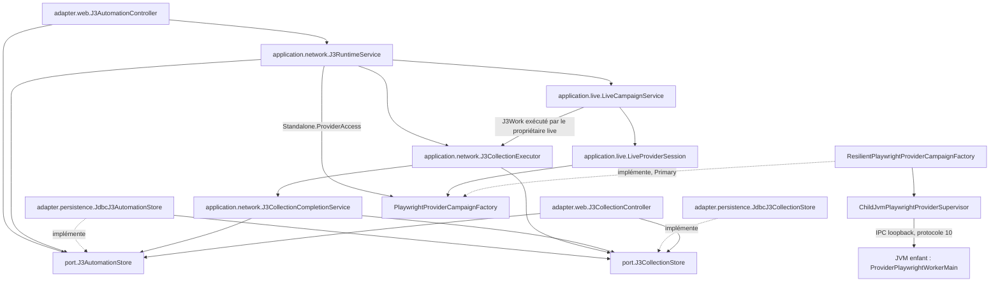

# Revue d’architecture — J3 durable et worker Playwright

## 1. Conclusion et portée

**Le parcours actuel possède des frontières d’exécution identifiables : ordre durable, consommateur J3 sériel, exécution des pages, publication transactionnelle et supervision d’un worker séparé.** La pause live conserve le thread propriétaire, le garde fournisseur et le contexte live ; elle ouvre temporairement un contexte J3 distinct dans le même worker.

La revue fait ressortir trois points à traiter :

1. **Un défaut local dans la file d’import en mémoire** : une soumission conflictuelle peut supprimer les octets d’un import déjà admis.
2. **Une limite de clôture du ledger J8 après échec de publication** : le repli peut terminer J3 sans résultat terminal J8 ; un test l’établit explicitement.
3. **Des lacunes de qualification** : le test Spring fourni charge uniquement le superviseur, et le test natif de pause J3 nécessite une sélection Maven explicite.

Aucune refonte en modules ni nouvelle interface générale n’est justifiée par ces constats.

### Identité de la revue

| Élément | Référence retenue |
|---|---|
| Cas | `CURRENT_COMMITTED_CODE_REVIEW`, JM-N01 |
| Commit déclaré par `input.json` | `6648dd423e556b5248b8793a539ae85a7680f9bc` |
| Date de référence du cas | 15 septembre 2026 |
| Racine | Worktree fourni, terminé par `ss-java-module/run-03/JM-N01` |
| Autorisation | Analyse et proposition uniquement |
| Exécution nouvelle | Aucune compilation, aucun test, aucun lancement |
| Modifications | Aucun fichier modifié |

Le SHA est **déclaré par l’entrée du cas**, sans vérification Git indépendante. Le skill demandé a été lu intégralement avant l’analyse. Les autres lectures sont limitées aux fichiers autorisés et aux sections utiles.

Les statuts restent : `EXPERIMENTAL`, `LOCAL_ONLY`, `NOT_PRODUCTION_APPROVED`, `NO_CRITICAL_DEPENDENCY`.

L’[ADR-SS-007 courant][adr] est en **v0.3**. Son introduction distingue la réalisation durable des descriptions historiques conservées plus bas. Les mentions anciennes de catalogue en mémoire, de schéma V54 ou d’absence de pause J3 ne décrivent donc pas le parcours courant. Le complément v0.3 concerne le clic direct tournoi ; les classes de cette découverte ne sont pas dans le corpus de cette revue.

## 2. Carte des responsabilités et dépendances

Tous les packages Java ci-dessous sont préfixés par `com.bettingproject.sofascorelocal`.



Le diagramme présente les liens principaux ; les dépendances auxiliaires importantes sont explicitées ci-dessous.

| Classe ou interface exacte | Responsabilité et dépendances observées |
|---|---|
| `adapter.web.J3AutomationController` | POST collecte, import, préférences, horaires, annulation et nettoyage ; consommation du jeton via `LocalFormTokenService` ; délégation à `J3RuntimeService`. Consultation d’ordre directement via `J3AutomationStore`. |
| `application.network.J3RuntimeService` | Activation, identité propriétaire, réconciliation au démarrage, ticks, admission manuelle, file d’octets importés, consommateur sériel, watchdog et choix entre ressource autonome et pause live. Dépend aussi de `J3LegacyRecoveryService`, `J3ProviderQualificationPolicy`, `ProviderCampaignGuardStore`, `ProviderResilienceStore` et `ManualProviderRequestCoordinator`. |
| `port.J3AutomationStore` → `adapter.persistence.JdbcJ3AutomationStore` | Préférences, leadership, règles/révisions, ordres, admission, claim et terminal. L’adaptateur utilise `NamedParameterJdbcTemplate` et **dépend aussi de `J3CollectionStore`** pour vérifier les succès antérieurs. |
| `application.network.J3CollectionExecutor` | Parcours commun de 1 à 35 pages : import, cache ou fournisseur ; preuves brutes, audit J8, projection et clôture. Utilise `RawManualCallSnapshotStore`, `J3ScheduledEventsPageCache`, `J3CollectionStore`, `J3CatalogProjector`, `J8BenchmarkAuditService` et `J3CollectionCompletionService`. |
| `J3CollectionExecutor.ProviderAccess` | Contrat d’exécution et de fermeture de la ressource fournisseur. Implémenté par `J3RuntimeService.Standalone` et par l’accès temporaire construit dans `LiveCampaignService.runJ3`. Le callback `beforeDispatch` place le début de tentative après admission technique. |
| `application.network.J3CollectionCompletionService` | Frontière transactionnelle terminale. `publish` enchaîne publication de collection, terminal J8 si une session est fournie, puis terminal d’ordre. `interrupt` réconcilie collection et ordre. |
| `port.J3CollectionStore` → `adapter.persistence.JdbcJ3CollectionStore` | Runs, pages, projection, références sources, dernier succès par date, consultation paginée et références de reprise historique. Persistance JDBC et JSONB. |
| `adapter.web.J3CollectionController` | GET de consultation et de preuve minimisée. Dépend de `J3CollectionStore`, avec injection complémentaire de `J3AutomationStore` et `J3LivePauseStore`. Aucun appel d’acquisition dans les méthodes lues. |
| `application.live.LiveCampaignService` | Accepte le transfert temporaire par `submitJ3`, persiste les phases via `J3LivePauseStore`, puis exécute `J3Work` sur le propriétaire live. Conserve la lease et vérifie le garde avant les départs et la reprise. |
| `application.live.LiveProviderSession` | Possède la campagne fournisseur live. Sélectionne `openLiveGroupedV11` pour `live-v11` et délègue `openJ3SubOperation`. Les validateurs conditionnels live restent locaux à cette session ; ils ne sont pas fournis à J3. |
| `application.network.playwright.PlaywrightProviderCampaignFactory` | Interface de création de campagnes, y compris capacité V11 explicite. Ses méthodes par défaut refusent les capacités non implémentées. |
| `application.network.playwright.PlaywrightProviderSupervisor` | Interface de supervision : arrêt et identité de campagne active. |
| `application.network.playwright.ResilientPlaywrightProviderCampaignFactory` | Décorateur `@Primary` : réservations de départ, délais, refus 403/429 et clôture des réservations. Son constructeur Spring reçoit concrètement `ChildJvmPlaywrightProviderSupervisor`. |
| `application.network.playwright.ChildJvmPlaywrightProviderSupervisor` | Implémente les deux interfaces précédentes. Possède la JVM enfant, l’IPC, les verrous d’échange, l’identité des processus et la preuve de nettoyage. |
| `provider.playwright.worker.ProviderPlaywrightWorkerMain` / `ProviderPlaywrightWorkerProtocol` | Entrée du worker, protocole binaire et exécution Chromium. `WorkerRuntime`, classe interne du main, possède navigateur et contextes. Sources ajoutées seulement par le profil Maven dédié. |

### Les dépendances ne forment pas une séparation parfaite par packages

L’[exécuteur][executor] :

- reçoit le catalogue concret `adapter.sofascore.SofascoreEndpointCatalog` pour son TTL ;
- instancie directement `adapter.sofascore.scheduledevents.ScheduledEventsV1Parser` ;
- construit `J3ScheduledEventsOutcomeProcessor` ;
- capture l’exception d’adaptateur `adapter.sofascore.transport.ScheduledEventsTransportException`.

Ces dépendances existent et doivent rester visibles dans toute proposition. Il n’y a pas de port de parsing à substituer artificiellement dans la carte.

Inversement, `PlaywrightProviderCampaignFactory` et `PlaywrightProviderSupervisor` sont bien des **contrats d’exécution**, malgré leur emplacement sous `application.network.playwright`. Leur présence dans les sources standard n’ajoute pas la bibliothèque navigateur au classpath standard.

## 3. Parcours fonctionnel et distinctions de domaine

### De l’entrée Web à l’ordre durable

`J3AutomationController` expose notamment :

- `POST /j3/collect` → `runtime.manual(orderId, date, null)` ;
- `POST /j3/import` → lecture du lot puis `runtime.manual(...)` ;
- `POST /j3/settings` → `configure` ;
- `POST /j3/plans` → `schedule` ;
- `GET /j3/orders/{id}` → suivi durable, puis redirection vers la date.

L’import Web contrôle les noms `page-1.json` à `page-35.json`, les doublons, la continuité et le total de 25 Mio. La limite unitaire est référencée par `RawPayloadEvidence.MAXIMUM_BYTES` ; le runbook indique 5 Mio. La validation complète et l’empreinte passent par `J3LocalBatchValidator`, dont l’implémentation n’est pas autorisée à la lecture.

Le contrôleur traite aussi certains rejets métier enveloppés dans `InvalidDataAccessApiUsageException` pour les horaires. Les erreurs de persistance non reconnues ne sont pas converties arbitrairement en erreurs de formulaire.

### Déclencheur, source et temps sont des dimensions distinctes

Les deux classes de domaine l’établissent explicitement :

| Dimension | Représentation |
|---|---|
| Déclencheur de collecte | `MANUAL_PROVIDER`, `MANUAL_IMPORT`, `DAILY`, `DAILY_AT`, `SCHEDULED`, `LEGACY` |
| Acquisition de chaque page | `PROVIDER`, `CACHE`, `LOCAL_JSON_IMPORT` dans les preuves utilisées |
| Date métier | `Order.date` / `Proof.date`, calendrier demandé |
| Horaire et exécution | `dueAt`, `createdAt`, `admittedAt`, `deadline`, `startedAt`, `finishedAt` sous forme d’`Instant` |
| Fuseau civil | `J3AutomationData.ZONE = Europe/Paris` |
| Identité d’ordre | UUID, clé d’occurrence, éventuelle règle et révision |
| Identité propriétaire | UUID de propriétaire, PID et instant de démarrage du processus |

Une collecte automatique peut donc réussir entièrement depuis le cache. Un import manuel réussi satisfait aussi la règle de succès quotidien pour sa date cible.

`resolveOneShot` refuse une heure inexistante et exige un offset explicite lors d’un chevauchement. `dailyOccurrence` avance une heure récurrente inexistante à la transition et retient le premier instant d’une heure doublée. La date cible ne change pas au passage de minuit.

### Admission et consommation

Dans [l’adaptateur des ordres][orders-jdbc] :

- les mutations prennent `pg_advisory_xact_lock(-6060)` puis verrouillent la ligne de préférences ;
- `schedule` contrôle identité et révision, avec 100 plans actifs au maximum ;
- `manual` vérifie date, déclencheur et empreinte pour un UUID déjà connu ;
- l’admission fixe une échéance à **20 minutes**, attente comprise ;
- `claim` refuse un deuxième ordre lorsque l’un est `RUNNING` ;
- le succès est relu au claim pour une opportunité `DAILY` ;
- les horaires explicites restent exécutables après un succès ;
- les échéances manquées deviennent `MISSED`, sans rattrapage fournisseur ;
- les jours fixes absents sont matérialisés par lots de 31 au maximum par tick.

La file des octets importés est **volatile et bornée à huit lots**. L’ordre est durable ; ses octets en attente ne le sont pas. Le redémarrage réconcilie un ordre interrompu, sans rejouer l’import.

### Exécution et consultation

`J3CollectionExecutor.execute` n’est pas transactionnel dans son ensemble. Il :

1. ouvre le run et la session d’audit ;
2. traite les pages séquentiellement ;
3. utilise exclusivement les octets fournis pour un import ;
4. cherche un cache frais et compatible avec le parseur pour une collecte fournisseur ;
5. ouvre effectivement le transport seulement lorsqu’un départ est nécessaire ;
6. enregistre chaque preuve de page ;
7. projette le catalogue lorsque la page terminale est atteinte ;
8. ferme l’accès fournisseur ;
9. appelle la publication terminale.

`J3CollectionData.Proof` interdit un succès sans pages complètes, contiguës, parsées, avec snapshots distincts et une seule fin de pagination. Un catalogue vide peut être un succès.

La consultation utilise le dernier succès **par date**, puis un couple exact **identifiant de collecte/date** pour la pagination. Les tailles admises sont 25, 50 et 100, avec tri déterministe terminé par `tournament_id`. Une tentative échouée ne remplace pas le pointeur de succès. Un succès historique dont les octets ont disparu peut rester attesté tout en étant indisponible à la consultation.

## 4. Activation Spring, Maven et frontières de processus

### Composition et activation Spring

Les services et adaptateurs lus sont déclarés par `@Service`, `@Repository` ou `@Component`. Leur présence comme beans ne vaut pas démarrage du fournisseur.

Le démarrage normal de [J3RuntimeService][runtime] exige successivement :

1. `ApplicationReadyEvent` provenant d’un `WebApplicationContext` avec `ServletContext` ;
2. `server.address` exactement égal à `127.0.0.1` ;
3. propriété injectée `sofascore.j3.runtime-enabled=true` ;
4. profil Spring `local` ;
5. acquisition du leadership durable ;
6. interruption des ordres dont le propriétaire est prouvé absent ;
7. reconstruction historique hors transport.

Ensuite seulement sont activés le tick de 500 ms et le consommateur sériel. Un watchdog distinct surveille les ruptures temporelles et les échéances.

**Nuance :** le contrôle Web/loopback se trouve dans `onApplicationReady`. La méthode publique `start()` contrôle le profil et la propriété, mais ne refait pas ce contrôle Web. Les tests de runtime l’appellent directement. Cela décrit leur portée ; aucun autre appel applicatif à `start()` n’est établi par le corpus.

Dans les configurations fournies :

- le profil Spring par défaut est `local` ;
- `server.address=127.0.0.1` ;
- le runtime J3 est activable par défaut ;
- `sofascore.enabled`, la qualification J3, Playwright et le live restent désactivés par défaut ;
- origine, allowlist et chemin de worker restent à renseigner ;
- `application-local.yml` porte le timeout de requête Playwright à 20 secondes par défaut.

Le `@Value` du runtime prouve son binding précis. Les classes `SofascoreProperties`, `ProviderPlaywrightProperties` et `LiveCampaignProperties` ne sont pas autorisées : **leur binding complet et leurs validations ne sont pas vérifiés**. Les valeurs effectives de l’environnement et de `.env` ne le sont pas davantage.

### Décorateur réellement prévu par Spring

La composition visible est :

```text
injection PlaywrightProviderCampaignFactory
    → ResilientPlaywrightProviderCampaignFactory (@Primary)
    → ChildJvmPlaywrightProviderSupervisor

injection PlaywrightProviderSupervisor
    → ChildJvmPlaywrightProviderSupervisor
```

Le constructeur `@Autowired` du superviseur reçoit `ProviderPlaywrightProperties` **et** `SofascoreProperties`, notamment pour le délai minimal.

Le test Spring fourni importe uniquement le superviseur. Il vérifie donc la publication de ses deux interfaces dans ce contexte réduit, **sans couvrir la sélection du décorateur `@Primary` dans la composition complète**.

### Monomodule et worker

Le [POM][pom] définit un **seul module Maven** :

- Java 25, avec Enforcer `[25,26)` ;
- Spring Boot `4.1.0` ;
- Maven `[3.9.0,4.0.0)`, wrapper configuré en `3.9.16` ;
- version du projet `0.1.0-rc.1-SNAPSHOT`.

Le profil `provider-playwright-runtime` ajoute :

- la dépendance Playwright `1.62.0` ;
- `src/provider-playwright/java` ;
- `src/provider-playwright-test/java` ;
- des sorties sous `target/provider-playwright-runtime/` ;
- le JAR classifié `provider-playwright-worker`, avec `ProviderPlaywrightWorkerMain`.

Ces sorties distinctes évitent de confondre les classes d’un build de profil avec les classes standard.

**Compiler le profil, produire le JAR et lancer Chromium sont trois opérations distinctes.** Le lancement effectif intervient lorsque le superviseur ouvre une campagne, démarre la JVM enfant, authentifie son IPC et lui envoie `START` ou `START_WITH_J3_PAUSE`.

Surefire et Failsafe reçoivent `sofascore.j3.runtime-enabled=false`. Le profil `sofascore-live-test` conserve un garde Enforcer `alwaysFail`.

## 5. Transactions, publication et comportement en échec

### Frontières observables

| Phase | Garantie visible | Limite |
|---|---|---|
| Paramètres/admission/claim | Transactions courtes et verrou commun `-6060` | Leadership J3 distinct du garde fournisseur |
| Exécution des pages | Aucun englobement transactionnel du réseau dans le runtime ou l’exécuteur | Octets bruts, cache et unités J8 peuvent être conservés avant le terminal |
| `appendPage` | Verrou de run et contrôle d’identité JSONB | Certaines interdictions finales relèvent des contraintes SQL non lues |
| `publish` de collection | Verrou commun, identité du run, pages, présence des octets, projection, sources et pointeur par date | Ne couvre pas à lui seul l’ordre et J8 |
| `J3CollectionCompletionService.publish` | Appel entre beans : collection → terminal J8 éventuel → ordre dans une transaction déclarée | Implémentations J8 et composition transactionnelle complète non lues |
| Pause live | Transitions persistées avec l’ownership ; exclusion maintenue en cas d’incertitude | Plusieurs publications successives, sans transaction unique avec tout J3 |

L’appel de l’exécuteur au [service de completion][completion] traverse un bean distinct. Les appels internes de `JdbcJ3CollectionStore.publish` vers `appendPage` restent dans la transaction extérieure déjà ouverte ; il n’est pas nécessaire d’inventer une nouvelle transaction pour ces appels internes.

Les IT construisent explicitement des proxies transactionnels avec `JdbcTransactionManager` et la même datasource. Ils fournissent des scénarios substantiels pour cette composition, mais pas une preuve nouvelle de la configuration Spring Boot complète.

### Perte de réponse du commit

Après exception de publication, l’exécuteur relit `committedProof(runId)` avant toute autre décision. Cette méthode compare l’état et le motif du run avec ceux de l’ordre. Le test `lostSuccessfulCommitResponseIsReconciledWithoutRepeatingTheCollection` simule un commit réussi suivi d’une exception et vérifie l’absence de duplication.

Cette relecture **ne vérifie pas directement le terminal J8 ni le pointeur de dernier succès**. Elle s’appuie sur l’atomicité du chemin de succès ; elle ne constitue pas une vérification indépendante de tout le ledger.

### Lacune établie : terminal J8 absent dans le repli

Après un échec de publication non reconnu comme déjà committé, l’exécuteur appelle :

```java
completion.publish(failed, List.of(), order.owner(), null);
```

Le paramètre `audit` nul omet la clôture J8. Le test [J3CollectionExecutionIT][execution-it], méthode `terminalPublicationFailureRollsBackCatalogueAndJ8SuccessTogether`, vérifie explicitement :

- l’ancien succès conservé ;
- l’ordre terminé en `FAILED` ;
- **zéro ligne de résultat terminal J8** pour cette campagne.

Cela protège contre un faux succès. En revanche, le corpus ne démontre pas la réconciliation ultérieure du terminal J8 manquant. `completion.interrupt` ne clôt pas J8 non plus.

**Relais requis pour une correction : `ss-postgres-change`**, puis `ss-verify` pour qualifier rollback, réconciliation idempotente et perte de réponse du commit.

## 6. Pause live et frontière du worker

### Séquence actuelle

Dans [LiveCampaignService][live], `submitJ3` :

- exige `live-v11`, une session utilisable et `J3LivePauseStore` ;
- prend le verrou de dispatch ;
- borne l’échéance au minimum de celle de J3 et de la fin live ;
- exige plus de 130 secondes restantes ;
- pose le handoff en mémoire avant la demande persistée ;
- arrête la campagne si cette persistance échoue.

Les départs live vérifient `s.j3` avant l’émission. L’échange déjà parti termine sa réception et sa publication ; la boucle du propriétaire live appelle ensuite `runJ3`.

Les phases techniques observées sont :

```text
REQUESTED → QUIESCENT → J3_ACTIVE → CLEANED → RESUMING → RESUMED
                                      ou STOPPED
```

`J3_ACTIVE` dépend de l’ouverture effective d’un accès fournisseur : une résolution entièrement en cache peut éviter la création du contexte J3.

Le consommateur J3 attend un `CompletableFuture`. **Le thread live exécute le travail et garde sa lease** ; celle-ci n’est pas transférée au thread HTTP ou au consommateur J3.

### Double validation parent/worker

Le [superviseur parent][supervisor] contrôle notamment :

- capacité V11 ;
- thread propriétaire ;
- absence de sous-opération concurrente ;
- date et identité exactes ;
- endpoint `SCHEDULED_EVENTS` ;
- pages strictement croissantes, bornées à 35 ;
- absence de validateur conditionnel ;
- échéance et marge de timeout/nettoyage.

Le [protocole et le worker][worker] refont des validations à leur entrée :

- `START_WITH_J3_PAUSE` distinct de `START` ;
- UUID canonique, date ISO exacte et échéance future à 20 minutes au maximum ;
- bornes de page et de timeout ;
- champs compatibles avec l’endpoint ;
- identité/date de scope et progression des pages ;
- refus des commandes live pendant le scope J3.

La progression est **strictement croissante**, sans exiger chaque page intermédiaire au niveau transport : des pages peuvent avoir été résolues depuis le cache. La continuité complète est exigée par la preuve de collecte.

### Possession et nettoyage

`WorkerRuntime` conserve `liveContext` et crée un contexte temporaire J3 :

- non persistant ;
- sans JavaScript ;
- sans téléchargement ;
- avec service workers bloqués ;
- sans transfert de cookies.

Les routes d’un contexte qui n’est pas actif sont refusées. La navigation autorisée est un GET exact, unique ; redirections, requêtes inattendues et en-têtes sensibles sont bloqués.

`END_J3` ferme le contexte temporaire et vérifie qu’il reste exactement le contexte live initial avant l’acquittement `J3_CLOSED`. Le parent abandonne l’ancien groupe live. Le service reprend après publication terminale seulement si le résultat est sûr, le garde conservé et la campagne encore admissible.

Le décorateur de résilience applique à J3 `LEGACY_V1`, y compris pendant une pause V11 ; J3 n’emprunte pas le profil de pression plus élevé du live.

Pour une campagne autonome, l’exécuteur ferme le transport avant publication ; le runtime libère ensuite la lease. Un nettoyage incertain maintient `CLEANUP_REQUIRED` et attend une demande explicite de vérification. Le superviseur ne retire la campagne active qu’après contrôle du nettoyage de l’arbre de processus.

### Validation d’origine : preuve incomplète

Le worker appelle `ProviderPlaywrightWorkerConfiguration.fromEnvironment`, puis `uriFor(request)`. Cette classe, comme les propriétés typées parentes, est hors liste.

Le corpus montre l’IPC lié explicitement à `127.0.0.1` et des contrôles de scope, mais **ne permet pas de certifier la validation complète de l’origine de qualification avant effet réseau** :

- schéma ;
- hôte exact ;
- port TCP dans `1..65535` ;
- chemin autorisé ;
- absence de userinfo, query ou fragment inattendus.

Aucun défaut précis de borne de port n’est affirmé sans cette source. Les tests autorisés ne couvrent pas explicitement les ports 0 ou 65536. **Relais de qualification : `ss-verify`**, après extension explicite du corpus de revue.

## 7. Écart fonctionnel et proposition minimale

### Défaut de conservation d’un import déjà admis

Dans [J3RuntimeService.manual, ligne 144][runtime-import], les octets sont placés dans `imports` **avant** la validation durable de l’identité. Toute exception de `orders.manual` retire ensuite l’entrée.

Scénario déduit directement du code, non exécuté :

1. un import A est admis et reste en attente avec ses octets ;
2. un second lot B, valide mais différent, utilise le même `orderId` ;
3. `imports.put(id, pagesB)` remplace A ;
4. `JdbcJ3AutomationStore.manual` refuse l’empreinte incompatible ;
5. le `catch` supprime l’entrée mémoire ;
6. l’ordre A demeure enregistré, mais son exécution rencontre `J3_IMPORT_BYTES_UNAVAILABLE` et finit interrompue.

Le contrôle durable d’identité fonctionne ; c’est le traitement mémoire de la soumission rejetée qui altère le premier travail.

### Modification minimale proposée

**Conserver la responsabilité dans `J3RuntimeService.manual`.**

- Ne modifier les octets associés à une identité existante qu’après acceptation durable de cette identité.
- Conserver le lot précédemment admis lorsqu’une nouvelle soumission est rejetée.
- Éviter qu’un nettoyage d’échec retire des octets appartenant à une soumission antérieure.
- Maintenir la synchronisation entre publication du lot accepté et lecture par le consommateur.

Aucune nouvelle interface, migration, persistance des octets en attente ou modification du worker n’est nécessaire pour cette correction.

**Test ciblé proposé :** dans `J3RuntimeIT`, maintenir un premier travail actif, mettre l’import A en attente, soumettre B sous le même UUID, vérifier le rejet de B, puis l’exécution unique de A avec son empreinte et ses sources initiales. Ajouter le cas du doublon identique encore en attente.

Les tests existants vérifient le conflit dans le store et le doublon d’un import déjà terminé ; ils ne couvrent pas cette interaction avec le registre mémoire.

**Relais : `ss-verify`.** Le contrat JSON n’évolue pas. Toute évolution du parsing, du fingerprint ou de la provenance devra être relayée séparément vers `ss-data-contract-replay`.

### Autres suites ciblées

| Action proposée | Justification | Relais |
|---|---|---|
| Ajouter un test de composition Spring incluant superviseur et décorateur | Vérifier le bean `@Primary`, son délégué concret et l’interface de supervision sans lancer le worker | `ss-verify` |
| Inclure explicitement le test natif J3 dans le profil de qualification, ou conserver une commande ciblée obligatoire documentée | Son nom ne correspond pas à l’include actuel | `ss-verify` |
| Définir la clôture/réconciliation J8 après échec de publication | L’absence de terminal est établie ; son traitement ultérieur ne l’est pas | `ss-postgres-change`, puis `ss-verify` |
| Compléter la lecture des validations de configuration et leurs cas limites | Binding et borne de port non certifiables avec le corpus | `ss-verify` |
| Si parser/projection/preuve évoluent, examiner les contrats avant extraction d’un port | Couplage concret existant et provenance à préserver | `ss-data-contract-replay` |

## 8. Contrôles disponibles et modes d’exécution

**Tous les contrôles ci-dessous ont été lus, pas exécutés.**

| Contrôle | Méthodes ou vérifications pertinentes | Mode et limite |
|---|---|---|
| `ChildJvmPlaywrightProviderSupervisorSpringContextTest` | `springUsesTheProductionConstructorAndPublishesBothSupervisorPorts` | Surefire, `src/test/java`, contexte Spring réduit ; pas de navigateur, pas de décorateur chargé |
| `J3AutomationPersistenceIT` | `concurrentClaimsCannotAdmitTwoJ3Runs`, `liveProcessCannotLoseLeadershipToSecondInstance`, `successAfterDailyQueueingIsRecheckedWhileExplicitScheduleStillRuns`, tests d’échéances et révisions | Failsafe avec `integration-tests` ; PostgreSQL Testcontainers réel, horloges fournies aux stores, aucun fournisseur |
| `J3CollectionPersistenceIT` | `migrationPreservesPopulatedV54AndReappliesWithoutChange`, `failedAndRolledBackPublicationCannotEraseEarlierSuccess`, `retentionWaitsForConcurrentJ3PublicationAndPreservesItsSources`, reprise historique | Failsafe avec `integration-tests` ; bases jetables, proxies transactionnels explicites. La course de rétention porte sur une page tournoi déjà non éligible à la purge ; elle vérifie l’attente du verrou et la conservation, pas tous les cas J6 |
| `J3CollectionExecutionIT` | Imports 27/35, `page35WithMoreDataFailsWithoutDispatchingPage36`, cache seul, désactivation, perte de réponse du commit, rollback terminal | Failsafe avec `integration-tests` ; PostgreSQL réel et accès fournisseur simulé en processus |
| `J3RuntimeIT` | `firstStartupCollectsOnceAndRestartWithOtherDatesKeepsEachLastSuccess`, maintenance inerte, `admissionDeadlineCancelsClaimedOrderWithoutOpeningProvider`, admission inattendue | Failsafe avec `integration-tests` ; threads réels, PostgreSQL réel, environnement et transport simulés. `LiveCampaignService` est mocké : pas une qualification de pause live complète |
| `J3WorkerScopeProtocolTest` | Capacité START, identité/date/échéance, scope expiré ou prolongé, UUID non canonique | Surefire sous `provider-playwright-runtime`, source `src/provider-playwright-test/java` ; flux binaires en mémoire, aucun Chromium |
| `J3LivePauseWorkerQualificationIT` | `oneWorkerIsolatesJ3ThenRestoresLiveAuthorityAndItsOriginalContext` | Failsafe explicite, deux profils worker ; Chromium et serveur synthétique loopback. J4 → deux pages J3 → J4, refus de scopes invalides, cookies absents, même worker, délais et descendants terminés |
| `Verify-Local.ps1` | Recherche textuelle de transports/imports interdits, contrôle de présence/absence de chemins attendus | Script PowerShell distinct du cycle Maven ; ne constitue pas une analyse exhaustive de dépendances |
| Maven Enforcer / profil bloqué | Java 25, Maven 3.9.x, échec forcé de `sofascore-live-test` | Validation Maven ; ne prouve ni le binding effectif de l’application ni la qualité des résultats J3 |

Le test natif réutilise `LiveProviderSessionQualificationIT.Fixture`, hors liste : ses appels et assertions sont visibles, mais l’implémentation complète de la fixture n’a pas été inspectée. Ses refus via l’API parente ne remplacent pas des tests injectant directement des commandes IPC malformées à l’entrée du worker.

Aucune dépendance ni règle ArchUnit n’est établie par les fichiers examinés.

### Commandes de qualification à employer ultérieurement

Ces commandes sont proposées uniquement pour un contexte autorisant leur exécution, avec relais `ss-verify`.

**Cycle standard :**

```powershell
.\mvnw.cmd clean verify
```

Dans le POM fourni, Failsafe est configuré globalement mais ses goals sont liés par les profils. Cette commande seule ne démontre donc pas l’exécution des quatre IT J3.

**Intégration J3 ciblée :**

```powershell
.\mvnw.cmd -Pintegration-tests '-Dit.test=J3RuntimeIT,J3AutomationPersistenceIT,J3CollectionExecutionIT,J3CollectionPersistenceIT' verify
```

Les quatre classes correspondent au motif `**/integration/**/*IT.java`. Ce mode démarre PostgreSQL via Testcontainers.

**Protocole worker sans qualification native :**

```powershell
.\mvnw.cmd -Pprovider-playwright-runtime '-Dtest=J3WorkerScopeProtocolTest' test
```

**Qualification native ciblée, commande documentée :**

```powershell
.\mvnw.cmd -q '-Pprovider-playwright-runtime,provider-playwright-local-qualification' '-Dtest=J3WorkerScopeProtocolTest' '-Dit.test=J3LivePauseWorkerQualificationIT' package failsafe:integration-test@provider-playwright-loopback-qualification failsafe:verify@provider-playwright-loopback-qualification
```

Le profil de qualification inclut par défaut `**/*LocalQualificationIT.java`. **`J3LivePauseWorkerQualificationIT` ne correspond pas à ce motif** : `-Dit.test` et l’exécution nommée sont déterminants. Ce mode requiert les prérequis locaux du worker et du navigateur ; leur disponibilité n’est pas établie ici.

Enfin, [Verify-Local.ps1][verify] exécuterait d’abord `-DskipITs clean verify`, puis `-Pintegration-tests verify` avec `-WithIntegrationTests`. Son préflight référencé est hors corpus. Sa ligne finale `SOFASCORE_NETWORK_CALLS_EXECUTED=NO` est une déclaration du script, pas une observation réseau indépendante. L’option Maven `--offline` ne transformerait pas ces modes en tests sans base ni navigateur.

## 9. Preuves historiques et limites du verdict

Le [rapport WO-060 du 14 septembre][report] relate une qualification locale sur un autre contexte identifié : base `d4c3d8c…`, worktree WO-060, Java 25.0.4 et PostgreSQL 18.4-alpine.

Il rapporte :

- 2 364 tests Surefire, avec cinq exclusions explicites ;
- 276 tests Failsafe ;
- une qualification native de quatre requêtes loopback ;
- une pause jusqu’au J4 repris de 9 290 ms.

**Ces résultats restent historiques.** Le manifeste, les rapports bruts et les preuves JSON référencés sont hors liste ; aucun succès au commit déclaré dans `input.json` n’en est déduit. Le rapport attribue aussi des résultats Failsafe à `clean verify`, tandis que le POM courant ne montre pas leur liaison hors profils : cette différence ne peut pas être résolue à partir des seules sources autorisées.

Les incidents et corrections relatés doivent accompagner ce bilan :

- modification initiale du bytecode `LiveSchedule` invalidant des preuves V8/V9, suivie de l’isolation dans `LiveSessionSchedule` ;
- événement de disponibilité également émis en maintenance, suivi du garde Web ;
- menu masqué lorsque la découverte était désactivée, révélé par le test Web complet ;
- matérialisation corrigée des jours fixes manqués.

Les tests MVC, le planificateur V11, les adaptateurs de garde/pause, les migrations, le ledger J8 et leurs rapports complets ne sont pas tous inspectables dans ce corpus. Le code montre leurs points d’appel ; leur correction globale n’est pas certifiée.

**Décision proposée : conserver l’architecture actuelle et ouvrir une correction Java ciblée sur la conservation des imports admis, accompagnée de son test de régression.** Traiter séparément la clôture J8 et compléter la qualification Spring/Maven. La présente revue est une analyse statique utilisable pour cadrer ces changements ; elle ne vaut pas qualification exécutée.

[adr]: C:/Dev/BettingProject/codex/betting-sofascore-local-lab/.tmp/wo062-skills-lot2/.tmp/wo062-evaluations/ss-java-module/run-03/JM-N01/ADR-SS-007-j3-automation-durable-catalog-and-live-pause.md:3
[runtime]: C:/Dev/BettingProject/codex/betting-sofascore-local-lab/.tmp/wo062-skills-lot2/.tmp/wo062-evaluations/ss-java-module/run-03/JM-N01/src/main/java/com/bettingproject/sofascorelocal/application/network/J3RuntimeService.java:69
[runtime-import]: C:/Dev/BettingProject/codex/betting-sofascore-local-lab/.tmp/wo062-skills-lot2/.tmp/wo062-evaluations/ss-java-module/run-03/JM-N01/src/main/java/com/bettingproject/sofascorelocal/application/network/J3RuntimeService.java:144
[executor]: C:/Dev/BettingProject/codex/betting-sofascore-local-lab/.tmp/wo062-skills-lot2/.tmp/wo062-evaluations/ss-java-module/run-03/JM-N01/src/main/java/com/bettingproject/sofascorelocal/application/network/J3CollectionExecutor.java:32
[orders-jdbc]: C:/Dev/BettingProject/codex/betting-sofascore-local-lab/.tmp/wo062-skills-lot2/.tmp/wo062-evaluations/ss-java-module/run-03/JM-N01/src/main/java/com/bettingproject/sofascorelocal/adapter/persistence/JdbcJ3AutomationStore.java:25
[completion]: C:/Dev/BettingProject/codex/betting-sofascore-local-lab/.tmp/wo062-skills-lot2/.tmp/wo062-evaluations/ss-java-module/run-03/JM-N01/src/main/java/com/bettingproject/sofascorelocal/application/network/J3CollectionCompletionService.java:17
[pom]: C:/Dev/BettingProject/codex/betting-sofascore-local-lab/.tmp/wo062-skills-lot2/.tmp/wo062-evaluations/ss-java-module/run-03/JM-N01/pom.xml:222
[execution-it]: C:/Dev/BettingProject/codex/betting-sofascore-local-lab/.tmp/wo062-skills-lot2/.tmp/wo062-evaluations/ss-java-module/run-03/JM-N01/src/test/java/com/bettingproject/sofascorelocal/integration/J3CollectionExecutionIT.java:145
[live]: C:/Dev/BettingProject/codex/betting-sofascore-local-lab/.tmp/wo062-skills-lot2/.tmp/wo062-evaluations/ss-java-module/run-03/JM-N01/src/main/java/com/bettingproject/sofascorelocal/application/live/LiveCampaignService.java:71
[supervisor]: C:/Dev/BettingProject/codex/betting-sofascore-local-lab/.tmp/wo062-skills-lot2/.tmp/wo062-evaluations/ss-java-module/run-03/JM-N01/src/main/java/com/bettingproject/sofascorelocal/application/network/playwright/ChildJvmPlaywrightProviderSupervisor.java:768
[worker]: C:/Dev/BettingProject/codex/betting-sofascore-local-lab/.tmp/wo062-skills-lot2/.tmp/wo062-evaluations/ss-java-module/run-03/JM-N01/src/provider-playwright/java/com/bettingproject/sofascorelocal/provider/playwright/worker/ProviderPlaywrightWorkerMain.java:282
[verify]: C:/Dev/BettingProject/codex/betting-sofascore-local-lab/.tmp/wo062-skills-lot2/.tmp/wo062-evaluations/ss-java-module/run-03/JM-N01/scripts/Verify-Local.ps1:144
[report]: C:/Dev/BettingProject/codex/betting-sofascore-local-lab/.tmp/wo062-skills-lot2/.tmp/wo062-evaluations/ss-java-module/run-03/JM-N01/docs/validation/WO060-J3-IMPLEMENTATION-20260914.md:42