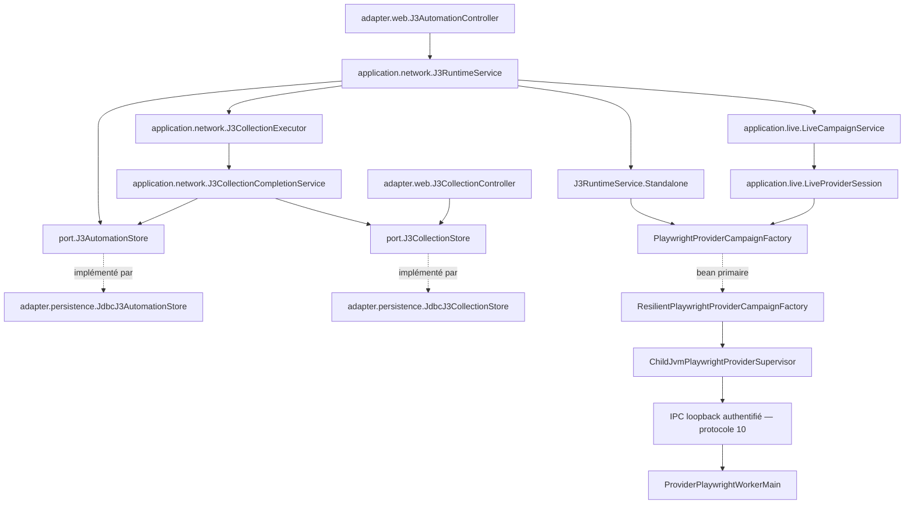

# Revue d’architecture — J3 durable et worker Playwright

**Conclusion : le parcours actuel possède les frontières nécessaires pour une évolution ciblée : ordres durables, consommation sérielle, ports de persistance, publication transactionnelle et worker JVM séparé. Une extraction en nouveaux modules Maven ou une refonte générale ne se justifie pas avec les éléments disponibles.**

La proposition minimale consiste à **rendre explicite l’inclusion de la qualification native J3 dans son profil Maven dédié et à compléter le contrôle de composition Spring avec la factory résiliente**. Deux points demandent une instruction complémentaire avant toute modification fonctionnelle : la clôture J8 après certains échecs de publication et la validation complète des origines à l’entrée du worker.

Statuts conservés : `EXPERIMENTAL`, `LOCAL_ONLY`, `NOT_PRODUCTION_APPROVED`, `NO_CRITICAL_DEPENDENCY`.

## 1. Périmètre et valeur des preuves

Le skill demandé a été **lu intégralement avec un outil local avant l’analyse**. La revue repose exclusivement sur les sections pertinentes des sources autorisées.

L’entrée du cas déclare :

- commit examiné : `6648dd423e556b5248b8793a539ae85a7680f9bc` ;
- situation à examiner au **15 septembre 2026** ;
- portée : soumission, admission, exécution, publication, consultation et passage temporaire dans le worker live ;
- autorisation : **analyse et proposition uniquement**.

Cette identité provient d’`input.json` ; elle n’a pas été corroborée par Git. Aucun build, test, lancement, accès réseau, accès DB ou changement de fichier n’a été effectué. Les seuls contrôles réalisés ici sont des lectures et recherches textuelles locales.

L’[ADR-SS-007][adr] est en version **0.3**. Son préambule précise que les formulations prospectives et constats anciens décrivent désormais le contrat adopté. De même, l’en-tête WO-060 d’`ARCHITECTURE.md` prévaut pour cette revue sur ses descriptions historiques du catalogue en mémoire et du protocole v5. L’exception autorise déjà les ordres J3 durables et le clic direct concernés ; elle n’arme pas les autres parcours.

## 2. Carte des responsabilités et dépendances actuelles

Les noms ci-dessous sont relatifs au préfixe Java `com.bettingproject.sofascorelocal`.



Cette carte résume le chemin principal. Les dépendances complémentaires ci-dessous sont importantes pour ne pas présenter une séparation plus stricte que celle du code.

| Élément exact | Responsabilité et dépendances observées |
|---|---|
| `adapter.web.J3AutomationController` | Consomme le jeton local ; reçoit collecte, import, préférences, plans, annulation et demande de nettoyage. Appelle `J3RuntimeService`. Lit directement `J3AutomationStore` pour le suivi d’ordre. |
| `domain.scheduledevents.J3AutomationData` | Définit `Settings`, `Owner`, `Order`, les états d’ordre, les clés d’occurrence et la résolution des heures Paris vers des `Instant`. Ne dépend pas du transport. |
| `domain.scheduledevents.J3CollectionData` | Définit déclencheur, preuve terminale, complétude des pages, entrées projetées, collection et pagination. Une collection complète peut contenir zéro tournoi. |
| `application.network.J3RuntimeService` | Possède le leader durable, le ticker, le consommateur sériel, les imports en attente et la réconciliation. Dépend des deux services d’exécution/publication, de `J3LegacyRecoveryService`, `J3ProviderQualificationPolicy`, `ManualProviderRequestCoordinator`, `ProviderCampaignGuardStore`, `ProviderResilienceStore`, des contrats Playwright et de `LiveCampaignService`. |
| `application.network.J3CollectionExecutor` | Exécute import, cache ou fournisseur ; borne les pages ; produit les preuves ; projette puis publie. Dépend de `RawManualCallSnapshotStore`, `J3ScheduledEventsPageCache`, `J3CollectionStore`, `J3CatalogProjector`, `J8BenchmarkAuditService` et `J3CollectionCompletionService`. |
| `J3CollectionExecutor.ProviderAccess` | Interface de substitution locale : `execute(request, beforeDispatch)` et `close()`. Implémentée par `J3RuntimeService.Standalone` ou par l’accès temporaire créé dans `LiveCampaignService.runJ3`. |
| `application.network.J3CollectionCompletionService` | Frontière transactionnelle externe : publication de collection, terminal J8 éventuel et terminal d’ordre ; réconciliation des interruptions. |
| `port.J3AutomationStore` → `adapter.persistence.JdbcJ3AutomationStore` | Préférences, leader, soumission, échéances, admission, claim et terminal. L’adaptateur dépend aussi de **`J3CollectionStore`** pour revérifier un succès quotidien. |
| `port.J3CollectionStore` → `adapter.persistence.JdbcJ3CollectionStore` | Runs, pages, catalogue, sources, dernier succès par date, récupération historique et consultation. |
| `adapter.web.J3CollectionController` | Lecture seule via `J3CollectionStore` ; enrichissement de la preuve via `J3AutomationStore` et `J3LivePauseStore`. Aucun appel à l’exécuteur ou à la factory. |
| `application.network.playwright.PlaywrightProviderCampaignFactory` | Contrat d’ouverture des campagnes, dont l’autorité explicite V11. Son package ne fait pas de lui la bibliothèque navigateur. |
| `application.network.playwright.PlaywrightProviderSupervisor` | Contrat de supervision : arrêt ciblé et identité de campagne active. |
| `ResilientPlaywrightProviderCampaignFactory` | Décorateur Spring `@Primary` : réservations de départ, suspension après refus et clôture des départs. Son constructeur injecté dépend concrètement de `ChildJvmPlaywrightProviderSupervisor`. |
| `ChildJvmPlaywrightProviderSupervisor` | Implémente les deux contrats ; possède la JVM enfant, l’IPC, les verrous de dispatch, l’autorité des sous-opérations et la vérification du nettoyage. |
| `application.live.LiveCampaignService` / `LiveProviderSession` | Le premier possède la campagne, la lease et les transitions de pause ; le second encapsule la campagne de transport, ses quatre familles live et l’ouverture de la sous-opération J3. |
| `provider.playwright.worker.ProviderPlaywrightWorkerMain` / `ProviderPlaywrightWorkerProtocol` | Le protocole décode les commandes bornées. `WorkerMain.WorkerRuntime` possède Playwright, Chromium, le contexte live et le contexte J3 temporaire. |

### Dépendances concrètes à conserver visibles

L’exécuteur n’est pas indépendant de tous les adaptateurs :

- il reçoit **`adapter.sofascore.SofascoreEndpointCatalog`** pour obtenir le TTL ;
- il instancie **`adapter.sofascore.scheduledevents.ScheduledEventsV1Parser`** ;
- il construit `J3ScheduledEventsOutcomeProcessor` ;
- il intercepte **`adapter.sofascore.transport.ScheduledEventsTransportException`**.

Ce sont des dépendances existantes, pas des ports hypothétiques. Elles constituent un couplage local à prendre en compte si le parsing ou le catalogue évolue ; elles ne justifient pas, à elles seules, une nouvelle interface. Voir [J3CollectionExecutor.java, constructeur et `execute`][executor].

### Distinctions métier structurantes

- **Déclencheur de collecte** : `MANUAL_PROVIDER`, `MANUAL_IMPORT`, `DAILY`, `DAILY_AT`, `SCHEDULED`, `LEGACY`.
- **Source d’une page** : fournisseur, cache ou import JSON local. Un ordre automatique peut aboutir entièrement depuis le cache.
- **Date cible** : `Order.date` / `Proof.date`, indépendante de l’heure de réception et figée pendant l’exécution.
- **Instants d’exécution** : `dueAt`, `admittedAt`, `deadline`, début et fin de collecte ; distincts des instants de demande, réception et résolution de chaque page.
- **Identité** : UUID d’ordre/run, clé d’occurrence, règle/révision et identifiants numériques de tournoi. Le libellé du tournoi ne sert pas d’identité.
- **Succès attesté et contenu disponible** : `hasSuccess(date)` peut rester vrai alors que `latest(date)` est vide, notamment après récupération historique sans octets exploitables.

Les règles d’heure ambiguë ou inexistante sont présentes dans `J3AutomationData` : choix explicite d’offset pour un horaire ponctuel ambigu ; première occurrence pour une récurrence ambiguë ; passage au premier instant valide pour une récurrence dans un intervalle inexistant.

## 3. De l’entrée Web à l’exécution

### Soumission et consultation

Les POST `/j3/collect` et `/j3/import` consomment le jeton puis appellent `runtime.manual(...)`. L’import vérifie d’abord les noms `page-N.json`, le nombre de fichiers, leur continuité et les tailles. Le runtime appelle ensuite `J3LocalBatchValidator` et conserve l’empreinte du lot dans l’identité de l’ordre.

**La réponse Web initiale confirme la soumission de l’ordre**, avec redirection vers son suivi. Elle ne constitue pas un succès de collecte.

Les fichiers des imports admis restent **en mémoire, avec huit lots au maximum**. L’ordre est durable ; ses octets en attente ne le sont pas. Après disparition du propriétaire, le parcours interrompt l’ordre au lieu de rejouer un import dont les octets manquent. Cette limite est documentée dans le runbook.

La consultation utilise des lectures de stockage et des couples exacts `collectionId/date`. Les tailles de page admises sont 25, 50 ou 100. Une ancienne collecte reste consultable après publication d’une nouvelle ; le contrôleur expose un lien vers la plus récente.

### Activation et propriétaire

Le chemin de démarrage normal de [J3RuntimeService][runtime] comporte plusieurs conditions distinctes :

1. `ApplicationReadyEvent` doit provenir d’un `WebApplicationContext` avec contexte servlet.
2. La propriété `server.address` doit valoir exactement `127.0.0.1`.
3. `start()` exige le profil Spring `local` et `sofascore.j3.runtime-enabled=true`.
4. `orders.lead(...)` obtient le rôle durable, identifié par UUID, PID et instant de création du processus.
5. Les anciens ordres dont le propriétaire est prouvé absent sont interrompus.
6. `recovery.recover()` précède le premier tick.
7. Un ticker toutes les 500 ms alimente un **unique consommateur**.

Nuance : `start()` est public et ne refait pas lui-même le contrôle Web/loopback de l’écouteur. Les tests l’appellent directement. Le garde Web est donc établi pour le chemin normal par événement ; il n’est pas intrinsèque à toute invocation possible de `start()`.

Le propriétaire de l’ordonnanceur J3 et le garde fournisseur sont **deux protections différentes**. Prendre le rôle J3 n’ouvre pas de navigateur et ne prouve pas que le fournisseur est disponible.

### Admission durable et consommation

`JdbcJ3AutomationStore` sérialise les mutations par `pg_advisory_xact_lock(-6060)` et verrouille la ligne de paramètres.

Les mécanismes visibles comprennent :

- révision attendue des préférences ;
- idempotence manuelle par UUID, date, déclencheur et hash ;
- clés quotidiennes et clés de règle/révision ;
- limite de 100 plans ponctuels actifs et limite de file manuelle ;
- un seul ordre `RUNNING`, toutes voies J3 confondues ;
- nouvelle vérification du succès avant le claim d’un ordre `DAILY` ;
- conservation des horaires explicites même si la date a déjà un succès ;
- horaires manqués terminalisés sans rattrapage ;
- lots de 31 jours pour matérialiser les récurrences fixes manquées.

La borne est de **20 minutes depuis l’admission**, attente comprise. La réservation réseau exige plus de **130 secondes restantes**. Si cette marge manque avant ouverture, le runtime termine l’ordre `CANCELLED / ADMISSION_DEADLINE_EXPIRED`, sans créer de collecte.

### Import, cache et fournisseur

L’exécuteur suit trois branches :

- **Import** : revalidation du lot et de son hash, fournisseur obligatoirement absent, aucun accès au cache fournisseur.
- **Cache** : recherche fraîche compatible avec le parseur, relecture du payload et preuve `CACHE`.
- **Fournisseur** : ouverture paresseuse lors du premier manque de cache, callback d’admission du départ, capture de réponse, traitement et stockage des preuves.

La boucle s’arrête à 35 pages. Un succès exige des pages contiguës, parsées, avec snapshots distincts et `hasNextPage=false` uniquement sur la dernière. Une page 35 annonçant une suite produit `PAGINATION_LIMIT_REACHED`.

Les erreurs identifiées deviennent des codes durables ; certaines exceptions génériques sont ramenées à `EVIDENCE_PROCESSING_FAILURE` ou `EXECUTION_INTERRUPTED`. Cela simplifie le terminal exposé, mais limite le diagnostic disponible dans ces seules preuves.

## 4. Transactions, publication et reprise

| Frontière | Comportement établi |
|---|---|
| Soumission/admission | Transactions courtes dans `JdbcJ3AutomationStore`. |
| Réseau et attente | Aucun `@Transactional` englobant `J3RuntimeService.execute` ou `J3CollectionExecutor.execute`. Les appels fournisseur se font après les opérations SQL d’admission. |
| Début et pages | `begin` et `appendPage` sont transactionnels ; les preuves de pages peuvent survivre à une collecte échouée. |
| Nettoyage fournisseur | `provider.close()` intervient avant la publication terminale. Une fermeture incertaine force un échec et interdit la reprise live. |
| Publication terminale | Appel de l’exécuteur vers **un autre bean**, `J3CollectionCompletionService.publish`, annoté `@Transactional`. Ordre des appels : collection → terminal J8 éventuel → terminal d’ordre. |
| Réponse de commit perdue | Relecture par `committedProof(runId)` ; aucun nouvel appel fournisseur pour le même ordre. |
| Interruption | `completion.interrupt` réconcilie collection et ordre, sans reprendre la pagination. |

Dans [JdbcJ3CollectionStore.publish][collectionstore], le même verrou consultatif `-6060` relie publication et admission quotidienne. La méthode verrouille le run, vérifie son identité et ses pages, contrôle la présence des octets bruts sous verrou partagé, écrit catalogue et références, puis avance `j3_last_success` seulement pour un succès. La révision départage les publications successives, y compris à précision temporelle égale.

Les appels internes `publish → appendPage` ne créent pas une nouvelle interception Spring, mais ils s’exécutent déjà dans la transaction de la méthode publique. Le point décisif est l’appel externe à [J3CollectionCompletionService.publish][completion].

### Ce qui est couvert et ce qui reste ouvert

Les sources de `J3CollectionExecutionIT` contiennent deux contrôles significatifs :

- `terminalPublicationFailureRollsBackCatalogueAndJ8SuccessTogether` provoque une exception après la dernière écriture d’ordre et attend le maintien de l’ancien succès ainsi que l’absence de succès J8 ;
- `lostSuccessfulCommitResponseIsReconciledWithoutRepeatingTheCollection` laisse la publication committer puis simule la perte de réponse ; il attend une seule publication, un seul terminal J8 et une seule occurrence brute.

Ces tests utilisent de **vrais adaptateurs JDBC et des proxies transactionnels construits avec `JdbcTransactionManager`**, pas le contexte complet de l’application. Ils établissent une couverture prévue de cette composition, pas son succès actuel.

**Lacune précise :** après l’échec de publication, le repli appelle `completion.publish(failed, ..., audit=null)`. Le test attend explicitement **zéro ligne terminale J8** pour ce run. De plus, `committedProof` compare la collection et l’ordre, sans lire J8, et `interrupt` ne clôt pas directement J8.

Cela ne démontre pas une publication de succès non atomique. En revanche, **une clôture ou réconciliation J8 systématique de ces chemins d’échec n’est pas établie par le corpus autorisé**. L’implémentation de `J8BenchmarkAuditService.Session` et de son stockage n’est pas autorisée à la lecture.

## 5. Frontière du worker et pause live

### Composition et exécution séparées

Le projet est **monomodule Maven**. Les répertoires du domaine et du worker ne sont pas des sous-modules.

Le [POM][pom] déclare Java **25**, Spring Boot **4.1.0** et Maven `3.9.x` via l’enforcer. Le wrapper vise Maven **3.9.16**, avec empreinte de distribution déclarée. Cela établit les versions demandées, pas celles effectivement installées pendant cette revue.

Pour le worker J3 :

- `provider-playwright-runtime` ajoute la dépendance `com.microsoft.playwright:playwright:1.62.0` et `src/provider-playwright/java` ;
- il ajoute les tests purs de `src/provider-playwright-test/java` ;
- ses classes et tests sortent dans `target/provider-playwright-runtime/...`, séparément des sorties standard ;
- à `package`, il produit le JAR classifié `provider-playwright-worker` avec `ProviderPlaywrightWorkerMain`.

**Compiler ces sources, produire le JAR et lancer Chromium sont trois étapes distinctes.** Le lancement intervient lorsque le superviseur ouvre une campagne autorisée puis envoie `START` ou `START_WITH_J3_PAUSE`. Les sources standard emploient les contrats et la supervision IPC, sans importer la bibliothèque navigateur dans les classes examinées.

### Composition Spring réelle

Les composants ne disparaissent pas parce que le transport est désactivé : leur présence comme beans et leur autorisation d’exécuter sont distinctes.

- `ResilientPlaywrightProviderCampaignFactory` est `@Primary`.
- Une injection de `PlaywrightProviderCampaignFactory` choisit donc ce décorateur dans une composition qui charge les deux composants.
- Le décorateur injecte concrètement `ChildJvmPlaywrightProviderSupervisor`.
- L’injection de `PlaywrightProviderSupervisor` vise le superviseur.
- Le constructeur `@Autowired` du superviseur reçoit **`ProviderPlaywrightProperties` et `SofascoreProperties`**, et utilise `getMinimumDelay()`.

Les YAML déclarent notamment :

- profil Spring par défaut `local` ;
- liaison `127.0.0.1` ;
- fournisseur et Playwright désactivés par défaut ;
- runtime J3 activé par défaut ;
- qualification J3 désactivée ;
- timeout Playwright de 10 s dans le YAML principal, surchargé à 20 s dans `application-local.yml`.

Le binding de `runtime-enabled` est visible directement dans `@Value`. Les classes de propriétés typées ne font pas partie de la liste autorisée : **leur binding complet et leurs validations ne sont pas démontrés ici**.

### Pause et retour nominal

Dans [LiveCampaignService][live], `submitJ3` :

1. exige une campagne compatible `live-v11` ;
2. prend le verrou de dispatch ;
3. fixe une échéance limitée par celle de l’ordre et celle de la campagne ;
4. installe l’exclusion en mémoire avant l’écriture durable de la demande ;
5. remet le travail au **thread propriétaire live**, par un `CompletableFuture`.

Le consommateur J3 attend ce futur ; il ne récupère pas la lease liée au thread live.

L’échange live déjà lancé termine son chemin de traitement. Les admissions suivantes refusent tout départ si `s.j3 != null`. Le propriétaire exécute ensuite `runJ3`. Les phases exactes utilisées sont :

```text
REQUESTED → QUIESCENT → J3_ACTIVE → CLEANED → RESUMING → RESUMED
                                  ↘ STOPPED en cas d’incident
```

`J3_ACTIVE` n’est atteint que si un accès fournisseur est nécessaire : la sous-opération est ouverte paresseusement. Une collecte entièrement issue du cache ne crée donc pas de contexte J3 temporaire.

Le décorateur résilient conserve le comptage partagé, tout en appliquant à J3 `DepartureProfile.LEGACY_V1`. J3 n’emprunte pas les plafonds plus permissifs du live.

### Validations parent et enfant

Le [superviseur][supervisor] contrôle notamment :

- capacité V11 et thread propriétaire ;
- absence de sous-opération concurrente ;
- identité/date du scope ;
- endpoint `SCHEDULED_EVENTS` ;
- pages strictement croissantes, au plus 35 ;
- absence de validateur conditionnel ;
- marge de timeout et nettoyage ;
- acquittements `J3_READY` et `J3_CLOSED` corrélés au run.

Le [protocole worker][protocol] et [WorkerMain][worker] contrôlent séparément la capacité, l’UUID canonique, la date, l’échéance de moins de 20 minutes, l’endpoint et les pages. Les pages réseau peuvent sauter un numéro résolu depuis le cache ; la complétude finale reste vérifiée sur l’ensemble des preuves.

Dans `WorkerRuntime` :

- `beginJ3` exige un navigateur connecté, le contexte live exact et aucune page live ouverte ;
- un contexte neuf temporaire est créé sans transfert de session ;
- les routes du contexte inactif sont refusées ;
- `endJ3` ferme le contexte temporaire et vérifie que le contexte live d’origine est l’unique contexte restant.

### Perte du navigateur ou du contexte live

La restitution nominale ne couvre pas la panne.

Si `endJ3` ne retrouve pas le navigateur connecté et le contexte live conservé, il échoue avec `J3_CLEANUP_UNVERIFIED`. La boucle worker renvoie un échec de protocole et se termine. L’exécuteur refuse alors la reprise ; `LiveCampaignService` passe la pause à **`STOPPED`** et la session à **`STOPPED_ERROR`**. Les ruptures temporelles ou interruptions conduisent à **`STOPPED_INTERRUPTED`**.

Le nettoyage ferme le transport et ne libère la lease qu’après vérifications. Une incertitude garde l’exclusion et attend une demande explicite de nettoyage. **Aucun tick ne recrée le contexte live et aucune reprise automatique de cette session n’est prévue.**

### Origines : limite de preuve

L’IPC parent écoute sur `127.0.0.1` avec un port attribué par le système ; l’enfant s’y connecte et échange un handshake authentifié.

En revanche, l’origine des requêtes du navigateur passe par `ProviderPlaywrightProperties` puis `ProviderPlaywrightWorkerConfiguration.fromEnvironment()` et `uriFor(request)`. Ces classes ne sont pas autorisées à la lecture.

Il est donc impossible d’attester ici l’ensemble **schéma, hôte, port TCP utilisable, chemin, user-info, query et fragment** pour l’origine de qualification. En particulier, je ne conclus ni à la présence ni à l’absence d’un rejet des ports hors `1..65535`. La validation des scopes J3 ne remplace pas cette validation d’origine.

## 6. Contrôles disponibles, reliés à leur mode d’exécution

**Toutes les commandes suivantes sont des commandes de qualification proposées ou historiques ; aucune n’a été exécutée dans cette revue.**

| Contrôle et méthodes significatives | Mode réel et limites | Commande / sélection |
|---|---|---|
| `scripts/Verify-Local.ps1` | Recherche textuelle dans `src/main` sur `.java`, `.yml`, `.yaml`, `.properties`. Interdit exactement `\bcom\.microsoft\.playwright\b`, pas les interfaces internes nommées Playwright. Autre recherche dans `src/provider-playwright` contre les mécanismes interdits. Ce n’est pas une analyse complète des dépendances. | `.\scripts\Verify-Local.ps1` appelle `.\mvnw.cmd -DskipITs clean verify`. Avec `-WithIntegrationTests`, préflight puis `.\mvnw.cmd -Pintegration-tests verify`. |
| `ChildJvmPlaywrightProviderSupervisorSpringContextTest.springUsesTheProductionConstructorAndPublishesBothSupervisorPorts` | `src/test/java`, Surefire, contexte Spring réduit avec propriétés typées et **seul superviseur importé**. Aucun `open()`, aucun navigateur. Ne couvre pas le décorateur `@Primary`. | `.\mvnw.cmd '-Dtest=ChildJvmPlaywrightProviderSupervisorSpringContextTest' test` |
| `J3AutomationPersistenceIT` : `concurrentClaimsCannotAdmitTwoJ3Runs`, `firstStartEnabledAndFailedDailyOpportunityIsNeverRetriedOnSameDate`, `liveProcessCannotLoseLeadershipToSecondInstance` | PostgreSQL Testcontainers réel, proxies JDBC ; concurrence de threads et prédicat de vie simulé. Pas une qualification native de deux processus opérateurs. | Profil `integration-tests`, Failsafe, motif `**/integration/**/*IT.java`. |
| `J3CollectionPersistenceIT` : `failedAndRolledBackPublicationCannotEraseEarlierSuccess`, `exactDeduplicatedOccurrenceIsRequiredAndTerminalPublicationIsIdempotent`, `retentionWaitsForConcurrentJ3PublicationAndPreservesItsSources` | PostgreSQL réel ; conservation, rollback, références et attente sur verrou. La course de rétention utilise une page déjà non admissible à la purge J6 avant publication : elle ne prouve pas une purge générale de données admissibles. | Même profil et motif Failsafe. |
| `J3CollectionExecutionIT` : import direct et 27/35 pages, `cacheOnlySuccessReusesSourcesAndNeverDispatchesProviderRequest`, tests de rollback et de commit incertain | PostgreSQL réel, réponses synthétiques, transport et cache simulés selon le cas ; pas de Chromium. | Même profil et motif Failsafe. |
| `J3RuntimeIT` : `maintenanceContextCannotTakeLeadershipOrCollectEvenWithAllProviderFlagsEnabled`, `admissionDeadlineCancelsClaimedOrderWithoutOpeningProvider`, reprise après redémarrage | Threads réels du runtime et PostgreSQL ; qualification, coordinator, factory, superviseur et live simulés. Le harness force le runtime à `true`. | Même profil et motif Failsafe. |
| `J3WorkerScopeProtocolTest` : capacité explicite, identité/date/délai, scopes expirés ou non canoniques | `src/provider-playwright-test/java`, ajouté par `provider-playwright-runtime` ; Surefire `*Test`, flux mémoire. Aucun lancement navigateur. | `.\mvnw.cmd -Pprovider-playwright-runtime '-Dtest=J3WorkerScopeProtocolTest' test` |
| `J3LivePauseWorkerQualificationIT.oneWorkerIsolatesJ3ThenRestoresLiveAuthorityAndItsOriginalContext` | `src/provider-playwright-qualification-test/java` ; worker et Chromium natifs contre serveur synthétique loopback. Vérifie J4 → J3 → J4, refus, cookies absents, intervalles et extinction des descendants. Appelle directement le superviseur, sans composition SQL/résilience complète. | Deux profils et sélection `-Dit.test` explicite, voir ci-dessous. |

Commande ciblée pour les quatre IT PostgreSQL :

```powershell
.\mvnw.cmd -Pintegration-tests '-Dit.test=J3RuntimeIT,J3AutomationPersistenceIT,J3CollectionExecutionIT,J3CollectionPersistenceIT' verify
```

Commande native consignée dans le rapport WO-060 :

```powershell
.\mvnw.cmd -q '-Pprovider-playwright-runtime,provider-playwright-local-qualification' '-Dtest=J3WorkerScopeProtocolTest' '-Dit.test=J3LivePauseWorkerQualificationIT' package failsafe:integration-test@provider-playwright-loopback-qualification failsafe:verify@provider-playwright-loopback-qualification
```

**Écart de sélection établi :** le profil de qualification inclut `**/*LocalQualificationIT.java`, tandis que le test s’appelle `J3LivePauseWorkerQualificationIT`. La commande historique le sélectionne explicitement ; un simple `verify` avec les profils ne démontre pas son inclusion.

Surefire et Failsafe déclarent `sofascore.j3.runtime-enabled=false`. Cela inhibe le runtime par défaut ; cela ne rend pas toutes les suites sans effets : les IT démarrent PostgreSQL et la qualification native démarre explicitement un navigateur. De même, `--offline` ne serait pas un garde contre ces effets.

Aucune dépendance ou règle ArchUnit n’a été identifiée dans le POM et les tests autorisés examinés.

### Portée du rapport historique

Le [rapport du 14 septembre][history] déclare :

- 2 364 tests Surefire, cinq exclusions explicites ;
- 276 tests Failsafe ;
- qualification native loopback réussie ;
- une mesure J4 repris après pause de 9 290 ms et trois intervalles supérieurs à trois secondes.

Ces résultats restent historiques. Les manifestes, empreintes et rapports détaillés cités ne sont pas autorisés à la lecture.

Le rapport conserve aussi les incidents ayant conditionné la réalisation : modification de bytecode invalidant les preuves V8/V9, ensuite isolée par `LiveSessionSchedule` ; démarrage intempestif possible depuis un contexte de maintenance, ensuite gardé ; corrections du menu et des occurrences manquées. Il ne rapporte pas d’incident d’accès sandbox à un JAR : aucun incident de cette nature n’est ajouté à cette revue.

Enfin, son attribution de résultats Failsafe à `clean verify` ne suffit pas à expliquer leur sélection actuelle : **le POM lu ne lie les IT ordinaires au cycle que dans `integration-tests`**. Sans configuration effective ni journaux autorisés, cette différence reste non réconciliée.

## 7. Proposition minimale et risques à traiter

### Lot minimal recommandé

| Action proposée | Justification et critère de vérification | Relais |
|---|---|---|
| Ajouter l’inclusion exacte de `J3LivePauseWorkerQualificationIT` dans l’exécution **dédiée** `provider-playwright-loopback-qualification` | Éliminer la dépendance à une sélection manuelle oubliable. Vérifier sa présence dans le rapport Failsafe du profil et son absence du cycle standard. | **`ss-java-module`**, puis **`ss-verify`** pour les commandes et preuves. |
| Compléter le test de composition Spring en chargeant superviseur et factory résiliente, avec `ProviderResilienceStore` simulé | Vérifier que le port factory reçoit le décorateur primaire et que le port superviseur reçoit le superviseur ; vérifier l’injection des propriétés sans ouvrir de campagne. | **`ss-java-module`**, puis **`ss-verify`**. |
| Aligner la documentation des contrôles sur ces sélections | Séparer clairement standard, PostgreSQL, protocole pur et qualification native ; conserver les preuves anciennes avec leur date et leur portée. | **`ss-verify`**. |

Ce lot agit sur des lacunes directement observées. Il ne requiert pas de nouveau port, de nouveau module Maven ou de modification du protocole.

### Points à instruire avant une évolution fonctionnelle

| Risque ou lacune | Ce que permettent réellement les sources | Prochaine action et relais |
|---|---|---|
| **Terminal J8 absent après certains échecs** | Le repli sans audit et l’assertion de zéro terminal sont visibles. La réconciliation ultérieure n’est pas établie. | Examiner la session d’audit et le stockage J8, définir l’invariant terminal attendu et sa preuve de rollback/reprise. **`ss-postgres-change`**, puis **`ss-verify`**. |
| **Composition transactionnelle de l’application complète** | Les tests construisent leurs propres proxies JDBC ; ils ne qualifient pas le choix du gestionnaire transactionnel du contexte complet. | Ajouter une preuve ciblée de rollback via les beans effectivement injectés, avec fournisseur simulé. **`ss-postgres-change`** et **`ss-verify`**. |
| **Validation de l’origine, notamment du port** | Les points d’appel sont visibles ; les validateurs ne sont pas dans le corpus. Aucun défaut précis de borne n’est démontré. | Examiner les validateurs parent/enfant ; couvrir ports limites et champs URI avant tout effet. **`ss-java-module`**, **`ss-data-contract-replay`** si le contrat de configuration/protocole évolue, puis **`ss-verify`**. |
| **Panne pendant la restitution live** | Le code prévoit un arrêt terminal. Le test natif autorisé couvre le retour nominal, pas la perte forcée du contexte live pendant J3. | Ajouter une qualification dédiée attestant `STOPPED`, absence de reprise et absence de création d’un second worker. **`ss-verify`**, avec revue **`ss-java-module`** de la frontière d’exécution. |
| **Validation enfant indépendante** | Les mauvais appels du test natif peuvent être refusés par le parent avant d’atteindre l’enfant. Le test pur couvre le décodage des scopes. | Tester les commandes invalides directement à l’entrée IPC enfant, sous qualification isolée. **`ss-data-contract-replay`**, puis **`ss-verify`**. |
| **Parsing, provenance et reconstruction** | Les dépendances concrètes et assertions de tests sont visibles, mais pas les implémentations du parseur, projecteur, validateur de lot et service de reprise. | Toute modification de ces règles doit partir de leurs contrats et preuves exactes. **`ss-data-contract-replay`**, avec **`ss-postgres-change`** si les références persistées changent. |

**Décision proposée : conserver le découpage actuel et engager d’abord le lot minimal de qualification.** Les sources soutiennent une architecture cohérente pour J3 durable, avec des protections explicites contre la répétition et la reprise live incertaine. Elles ne permettent pas de déclarer la composition complète, toutes les validations d’origine ou tous les terminaux d’échec J8 qualifiés au commit annoncé.

**Bilan d’exécution de cette revue : aucun fichier modifié ; lectures locales par `Get-Content` et recherches `rg` uniquement ; aucun résultat nouveau de compilation, test ou lancement.**

[adr]: C:/Dev/BettingProject/codex/betting-sofascore-local-lab/.tmp/wo062-skills-lot2/.tmp/wo062-evaluations/ss-java-module/run-04/JM-N01/ADR-SS-007-j3-automation-durable-catalog-and-live-pause.md:28
[runtime]: C:/Dev/BettingProject/codex/betting-sofascore-local-lab/.tmp/wo062-skills-lot2/.tmp/wo062-evaluations/ss-java-module/run-04/JM-N01/src/main/java/com/bettingproject/sofascorelocal/application/network/J3RuntimeService.java:69
[executor]: C:/Dev/BettingProject/codex/betting-sofascore-local-lab/.tmp/wo062-skills-lot2/.tmp/wo062-evaluations/ss-java-module/run-04/JM-N01/src/main/java/com/bettingproject/sofascorelocal/application/network/J3CollectionExecutor.java:32
[completion]: C:/Dev/BettingProject/codex/betting-sofascore-local-lab/.tmp/wo062-skills-lot2/.tmp/wo062-evaluations/ss-java-module/run-04/JM-N01/src/main/java/com/bettingproject/sofascorelocal/application/network/J3CollectionCompletionService.java:17
[collectionstore]: C:/Dev/BettingProject/codex/betting-sofascore-local-lab/.tmp/wo062-skills-lot2/.tmp/wo062-evaluations/ss-java-module/run-04/JM-N01/src/main/java/com/bettingproject/sofascorelocal/adapter/persistence/JdbcJ3CollectionStore.java:61
[pom]: C:/Dev/BettingProject/codex/betting-sofascore-local-lab/.tmp/wo062-skills-lot2/.tmp/wo062-evaluations/ss-java-module/run-04/JM-N01/pom.xml:251
[live]: C:/Dev/BettingProject/codex/betting-sofascore-local-lab/.tmp/wo062-skills-lot2/.tmp/wo062-evaluations/ss-java-module/run-04/JM-N01/src/main/java/com/bettingproject/sofascorelocal/application/live/LiveCampaignService.java:71
[supervisor]: C:/Dev/BettingProject/codex/betting-sofascore-local-lab/.tmp/wo062-skills-lot2/.tmp/wo062-evaluations/ss-java-module/run-04/JM-N01/src/main/java/com/bettingproject/sofascorelocal/application/network/playwright/ChildJvmPlaywrightProviderSupervisor.java:768
[protocol]: C:/Dev/BettingProject/codex/betting-sofascore-local-lab/.tmp/wo062-skills-lot2/.tmp/wo062-evaluations/ss-java-module/run-04/JM-N01/src/provider-playwright/java/com/bettingproject/sofascorelocal/provider/playwright/worker/ProviderPlaywrightWorkerProtocol.java:340
[worker]: C:/Dev/BettingProject/codex/betting-sofascore-local-lab/.tmp/wo062-skills-lot2/.tmp/wo062-evaluations/ss-java-module/run-04/JM-N01/src/provider-playwright/java/com/bettingproject/sofascorelocal/provider/playwright/worker/ProviderPlaywrightWorkerMain.java:282
[history]: C:/Dev/BettingProject/codex/betting-sofascore-local-lab/.tmp/wo062-skills-lot2/.tmp/wo062-evaluations/ss-java-module/run-04/JM-N01/docs/validation/WO060-J3-IMPLEMENTATION-20260914.md:42