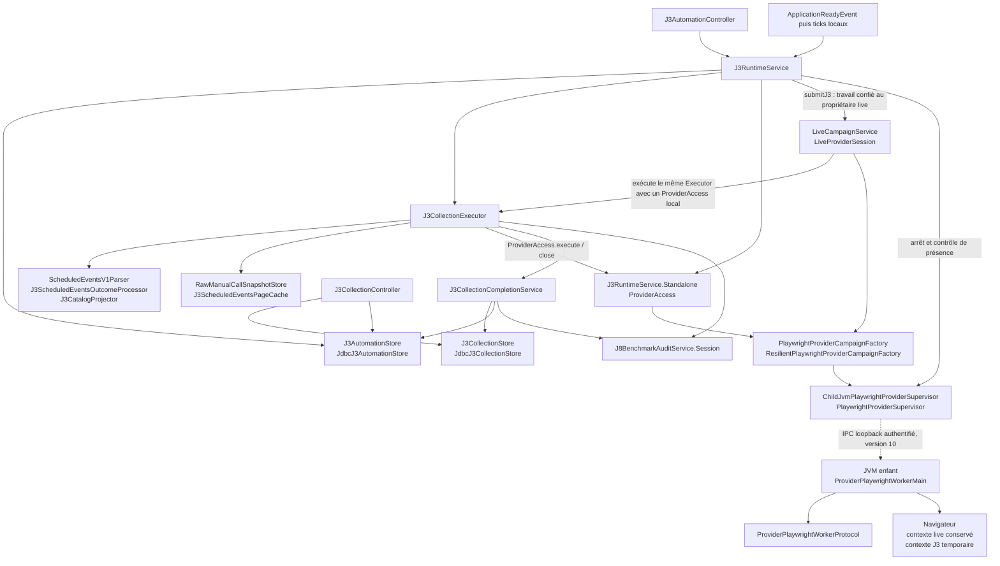

La structure actuelle du parcours J3 durable permet une évolution ciblée sans créer de module Maven supplémentaire : les ordres, leur exécution, la publication et la supervision du worker ont déjà des responsabilités distinctes. Les points à traiter en priorité sont la conservation du tampon d’un import lors d’une soumission contradictoire, la couverture de la composition Spring réelle et la clôture du ledger J8 après un échec de publication.

Cette revue porte sur le commit **`6648dd423e556b5248b8793a539ae85a7680f9bc` déclaré par `input.json`**, pour une question datée du **15 septembre 2026**. Le SHA et l’état Git n’ont pas été vérifiés indépendamment. Le skill demandé a été lu intégralement avec un outil local ; seules les sources autorisées ont été consultées. **Aucun fichier n’a été modifié et aucun build, test, service, accès réseau, navigateur, Docker ou PostgreSQL n’a été exécuté.** Les statuts restent `EXPERIMENTAL`, `LOCAL_ONLY`, `NOT_PRODUCTION_APPROVED` et `NO_CRITICAL_DEPENDENCY`.

L’ADR-SS-007 courant est en version **0.3**. Son exception adoptée autorise le clic direct et les ordres J3 durables du Lab configuré, ainsi que le contexte J3 temporaire pendant une pause live. Les passages prospectifs de l’ADR et les descriptions anciennes de collecte manuelle ou de catalogue en mémoire doivent être lus avec cette mise à jour. Le préambule d’`ARCHITECTURE.md` décrit le parcours durable, alors que certaines sections suivantes conservent notamment un plafond historique de 25 pages. Le code examiné utilise **35 pages**. [ADR-SS-007, état et portée](C:/Dev/BettingProject/codex/betting-sofascore-local-lab/.tmp/wo062-skills-lot2/.tmp/wo062-evaluations/ss-java-module/run-08/JM-N01/ADR-SS-007-j3-automation-durable-catalog-and-live-pause.md:3), [architecture, mise à jour WO-060](C:/Dev/BettingProject/codex/betting-sofascore-local-lab/.tmp/wo062-skills-lot2/.tmp/wo062-evaluations/ss-java-module/run-08/JM-N01/docs/architecture/ARCHITECTURE.md:3).

Le chemin effectif peut se représenter ainsi. Les flèches Java indiquent les appels ou dépendances observés ; la liaison vers le worker est une frontière IPC entre processus.



Les noms ci-dessous sont relatifs à **`com.bettingproject.sofascorelocal`**. Une dépendance dont le fichier n’est pas autorisé est signalée comme telle : son utilisation est visible, mais son implémentation n’a pas été inspectée.

| Classes et interfaces exactes | Responsabilité et sens des dépendances |
|---|---|
| `adapter.web.J3AutomationController` | Consomme le jeton local puis délègue les POST `/j3/collect`, `/j3/import`, `/j3/settings`, `/j3/plans`, annulation et nettoyage à `J3RuntimeService`. `readPages` contrôle les noms, la continuité et les tailles des fichiers. Le GET d’ordre lit directement `J3AutomationStore`. `LocalFormTokenService` est une dépendance visible, hors lecture autorisée. |
| `application.network.J3RuntimeService` | Possède l’identité du moteur, le ticker, le consommateur sériel, les imports en mémoire et la réconciliation locale. Appelle les ports d’ordres, de garde et de résilience ; les services de qualification, de reprise historique et de completion ; puis l’exécuteur ou le propriétaire live. |
| `domain.scheduledevents.J3AutomationData` | Définit `Settings`, `Owner`, `Order`, les états, les modes, les clés d’occurrence et la résolution des horaires à Paris. Ne dépend d’aucun transport. |
| `port.J3AutomationStore` ← `adapter.persistence.JdbcJ3AutomationStore` | Contrat de configuration, leadership, planification, admission et terminal d’ordre. L’adaptateur dépend de `NamedParameterJdbcTemplate` et de `J3CollectionStore` pour la recherche d’un succès déjà acquis. |
| `application.network.J3CollectionExecutor` | Exécute les pages, choisit import/cache/fournisseur, conserve les preuves, produit la projection et demande la publication terminale. Son interface imbriquée `ProviderAccess` porte `execute(request, beforeDispatch)` et `close()`. |
| `application.network.J3CollectionCompletionService` | Porte la transaction terminale entre collection, catalogue, dernier succès, terminal J8 et ordre. `committedProof` permet une relecture après réponse de commit incertaine. |
| `domain.scheduledevents.J3CollectionData` | Définit `Trigger`, `State`, `Proof`, `Entry`, `Projection`, `Collection`, les références historiques et la pagination. `Proof` interdit un succès incomplet ; `Entry` conserve une identité numérique et ses snapshots sources. |
| `port.J3CollectionStore` ← `adapter.persistence.JdbcJ3CollectionStore` | Contrat et adaptateur pour commencement, pages, publication, interruption, dernier succès, pagination et reprise historique. SQL observable vers `j3_collection_run`, `j3_collection_page`, `j3_catalog_entry`, `j3_catalog_source`, `j3_last_success`, `j3_legacy_recovery`, les snapshots et le ledger J8. |
| `adapter.web.J3CollectionController` | Consultation seule : sélection par date, pagination liée à l’ID de collecte et preuve minimisée V7. Dépend de `J3CollectionStore` et reçoit aussi `J3AutomationStore` et `J3LivePauseStore` pour enrichir la preuve. Aucun appel à l’exécuteur ou au transport dans ces GET. |
| `application.network.playwright.PlaywrightProviderCampaignFactory` et `PlaywrightProviderSupervisor` | Deux contrats distincts : ouverture de campagne d’une part ; arrêt ciblé et présence de campagne d’autre part. Leur emplacement dans `application.network.playwright` ne les rend pas dépendants de la bibliothèque Microsoft Playwright. |
| `application.network.playwright.ResilientPlaywrightProviderCampaignFactory` | Décorateur Spring `@Primary` de la factory. Injecte concrètement `ChildJvmPlaywrightProviderSupervisor` et le port `ProviderResilienceStore`. Réserve les départs, applique la pression et conserve les refus 403/429 ; aucune réouverture automatique de session. |
| `application.network.playwright.ChildJvmPlaywrightProviderSupervisor` | Implémente les deux contrats de factory et de supervision. Possède le processus enfant, l’IPC, les verrous de dispatch et d’entrée/sortie, l’autorité J3 et le contrôle de nettoyage de l’arbre de processus. |
| `application.live.LiveCampaignService` et `LiveProviderSession` | Le service reçoit `submitJ3`, conserve le propriétaire live et exécute `J3Work` sur ce thread. La session sélectionne explicitement `openLiveGroupedV11` et donne accès à `openJ3SubOperation`. Les transitions durables passent par `J3LivePauseStore`, dont l’implémentation est hors corpus. |
| `provider.playwright.worker.ProviderPlaywrightWorkerMain` et `ProviderPlaywrightWorkerProtocol` | Le premier possède réellement Playwright, Chromium et les contextes ; le second lit et valide les commandes du protocole 10. Le parent transmet des paramètres de requête, pas une URI libre dans les commandes J3. |

Cette carte comporte des dépendances concrètes qu’il faut conserver dans le diagnostic. `J3CollectionExecutor` reçoit **`adapter.sofascore.SofascoreEndpointCatalog`** pour le TTL, instancie **`ScheduledEventsV1Parser`** et **`J3ScheduledEventsOutcomeProcessor`**, et intercepte **`adapter.sofascore.transport.ScheduledEventsTransportException`**. Il ne passe donc pas exclusivement par des ports. Une autre branche intercepte les `RuntimeException` et les ramène à `EVIDENCE_PROCESSING_FAILURE`, ce qui conserve un arrêt prudent mais peut réduire la précision du diagnostic. Ces couplages ne justifient pas, à eux seuls, une refonte générale. [J3CollectionExecutor](C:/Dev/BettingProject/codex/betting-sofascore-local-lab/.tmp/wo062-skills-lot2/.tmp/wo062-evaluations/ss-java-module/run-08/JM-N01/src/main/java/com/bettingproject/sofascorelocal/application/network/J3CollectionExecutor.java:23).

Les données distinguent correctement plusieurs notions qui conditionnent le parcours :

| Dimension | Représentation et conséquence |
|---|---|
| Déclencheur de collecte | `MANUAL_PROVIDER`, `MANUAL_IMPORT`, `DAILY`, `DAILY_AT`, `SCHEDULED`, `LEGACY`. Seuls les trois déclencheurs automatiques rendent `Order.automatic()` vrai. |
| Source de chaque page | `PROVIDER`, `CACHE`, `LOCAL_JSON_IMPORT`, utilisée indépendamment du déclencheur. Une collecte automatique peut donc mélanger cache et fournisseur. |
| Date métier | `Order.date` et `Proof.date` désignent le calendrier demandé. Elles restent fixes si l’exécution passe minuit. |
| Instants d’exécution | `dueAt`, `admittedAt`, `deadline`, `startedAt`, `finishedAt` et les instants de réception/résolution sont distincts, représentés par `Instant`. Le JDBC normalise les instants concernés à la microseconde. |
| Horaire civil | `Europe/Paris`. Une planification ponctuelle refuse une heure inexistante et exige un offset pour une heure doublée. La récurrence avance au premier instant valide dans un trou et choisit la première occurrence dans un chevauchement. |
| Identité et provenance | La collecte est identifiée par UUID ; le catalogue utilise `tournamentId`, séparé des libellés et de `uniqueTournamentId`. Les entrées conservent leurs snapshots sources ; les preuves de page exposent hash, taille, occurrence éventuelle, parseur et heures. |

`J3CollectionData.complete` impose des pages 1 à N, N compris entre 1 et 35, des snapshots distincts, un statut parsé, une réponse 2xx et une seule terminaison `hasNextPage=false`. Une page terminale contenant zéro tournoi peut donc produire un succès vide. Les contrôles sémantiques complets du parseur et du projecteur restent une limite de cette revue, leurs fichiers n’étant pas autorisés. [J3AutomationData](C:/Dev/BettingProject/codex/betting-sofascore-local-lab/.tmp/wo062-skills-lot2/.tmp/wo062-evaluations/ss-java-module/run-08/JM-N01/src/main/java/com/bettingproject/sofascorelocal/domain/scheduledevents/J3AutomationData.java:9), [J3CollectionData](C:/Dev/BettingProject/codex/betting-sofascore-local-lab/.tmp/wo062-skills-lot2/.tmp/wo062-evaluations/ss-java-module/run-08/JM-N01/src/main/java/com/bettingproject/sofascorelocal/domain/scheduledevents/J3CollectionData.java:16).

L’activation résulte de plusieurs contrôles successifs. `onApplicationReady` exige un `WebApplicationContext`, un contexte servlet non nul et la propriété `server.address` exactement égale à `127.0.0.1`. `start` exige ensuite le profil Spring `local` et `sofascore.j3.runtime-enabled=true`. Il acquiert le leadership durable, interrompt les anciens ordres dont le propriétaire est démontré absent, appelle `J3LegacyRecoveryService.recover`, puis active le ticker de 500 ms.

Le ticker et le consommateur utilisent des **threads de plateforme dédiés**, malgré la configuration globale des threads virtuels. `wakeConsumer` sérialise les exécutions locales ; `claim` ajoute l’exclusion durable. Le propriétaire porte UUID, PID et instant de démarrage du processus : un PID seul n’est pas une preuve d’identité. L’absence d’information sur l’instant de démarrage d’un processus vivant est traitée avec prudence.

La disponibilité fournisseur est une autre étape : `providerUnavailableReason` consulte qualification, suspension, garde, départ non résolu et compatibilité live. La préférence automatique persistante peut ainsi être activée alors que le transport reste indisponible. L’import manuel valide son lot sans dépendre de cette disponibilité. Le bouton de désactivation automatique ne désactive pas le manuel ; l’interrupteur technique du runtime bloque en revanche l’admission manuelle également. [J3RuntimeService, démarrage et disponibilité](C:/Dev/BettingProject/codex/betting-sofascore-local-lab/.tmp/wo062-skills-lot2/.tmp/wo062-evaluations/ss-java-module/run-08/JM-N01/src/main/java/com/bettingproject/sofascorelocal/application/network/J3RuntimeService.java:57).

Une nuance mérite d’être gardée : **la vérification Web/loopback est dans `onApplicationReady`, pas dans la méthode publique `start`**. Les tests de runtime appellent directement `start`. Le démarrage par événement est bien gardé dans les sources lues ; une assertion disant que tout appel Java possible à `start` impose un contexte Web serait excessive.

La composition Maven et Spring est la suivante :

| Élément | Constat dans les fichiers autorisés |
|---|---|
| Socle | POM monomodule, Spring Boot **4.1.0**, Java **25**, Enforcer Java `[25,26)` et Maven `[3.9.0,4.0.0)`. Wrapper configuré pour Maven **3.9.16**. Ce sont les versions prescrites, pas des versions d’exécutables vérifiées ici. |
| Configuration standard | Profil Spring par défaut `local`, `server.address: 127.0.0.1`, fournisseur et Playwright désactivés par défaut, runtime J3 activé par défaut. `automatic-refresh-enabled` et `live-polling-enabled` restent `false`. |
| Configuration locale | `application-local.yml` porte notamment le timeout Playwright par défaut à 20 s, contre 10 s dans la configuration générale. |
| Tests Maven | Surefire et Failsafe imposent `sofascore.j3.runtime-enabled=false`. Un test construit manuellement avec `executionEnabled=true`, tel `J3RuntimeIT`, peut néanmoins exercer le moteur avec ses doubles de transport. |
| `provider-playwright-runtime` | Ajoute `com.microsoft.playwright:playwright:1.62.0`, `src/provider-playwright/java` et `src/provider-playwright-test/java`. Les sorties vont sous `target/provider-playwright-runtime`, séparément de `target/classes` et `target/test-classes`. |
| JAR worker | Le profil précédent ajoute un `repackage` en phase `package`, classifier `provider-playwright-worker`, main `ProviderPlaywrightWorkerMain`. Compiler le runtime, produire le JAR et lancer Chromium sont trois effets distincts. |
| Factory Spring | L’injection par `PlaywrightProviderCampaignFactory` sélectionne le décorateur `@Primary`; celui-ci délègue au superviseur concret. Le contrat `PlaywrightProviderSupervisor` expose directement le superviseur. |
| Constructeur du superviseur | Le constructeur de production annoté `@Autowired` reçoit `ProviderPlaywrightProperties` **et** `SofascoreProperties`, dont il utilise `getMinimumDelay()`. |
| `sofascore-live-test` | **Toujours volontairement bloqué** par Enforcer `alwaysFail`, exécution `block-live-tests-before-j3`. Ce profil ne constitue ni une activation de collecte ni une alternative à `j7-browser-origin-loopback-qualification`. |
| Propriétés typées | Le binding J3 est directement visible par `@Value`. Les classes `ProviderPlaywrightProperties`, `SofascoreProperties` et les politiques de qualification sont hors liste : leurs validations et leur binding complet ne peuvent pas être certifiés ici. |

La séparation des répertoires de sortie limite le risque qu’un résidu de compilation avec profil soit pris pour une preuve de compilation standard. Elle ne remplace pas une qualification du contenu des artefacts. [POM, profils et plugins](C:/Dev/BettingProject/codex/betting-sofascore-local-lab/.tmp/wo062-skills-lot2/.tmp/wo062-evaluations/ss-java-module/run-08/JM-N01/pom.xml:169), [configuration J3 et Playwright](C:/Dev/BettingProject/codex/betting-sofascore-local-lab/.tmp/wo062-skills-lot2/.tmp/wo062-evaluations/ss-java-module/run-08/JM-N01/src/main/resources/application.yml:215).

Les frontières transactionnelles sont courtes et séparées de l’attente réseau :

| Frontière | Opérations observées et portée |
|---|---|
| Configuration et admission | `JdbcJ3AutomationStore.readSettings(true)` acquiert `pg_advisory_xact_lock(-6060)` puis verrouille la ligne de paramètres. `configure`, `manual`, `schedule`, `tick`, `claim` et `finish` passent par des méthodes transactionnelles. |
| Prise en charge | `claim` refuse un second ordre `RUNNING`, applique échéance et activation, puis revérifie le succès pour `DAILY`. Les horaires explicites restent exécutables après un succès de la même date. |
| Publication et admission quotidienne | `JdbcJ3CollectionStore.publish` prend le même verrou `-6060`. Un succès manuel committé avant le claim quotidien peut donc empêcher son départ dans cette frontière commune. |
| Exécution | `J3RuntimeService.execute` et `J3CollectionExecutor.execute` ne portent pas de transaction englobant la collecte. Les pages, snapshots, cache et unités J8 sont traités progressivement. |
| Terminal nominal | L’exécuteur appelle le **bean distinct** `J3CollectionCompletionService.publish`. Sa transaction appelle successivement `collections.publish`, `audit.finishWithCollectionPublication` si l’audit existe, puis `orders.finish`. Ce n’est pas une auto-invocation de la méthode transactionnelle de completion. |
| Publication de collection | Verrou du run, vérification de son identité, pages exactes, présence des octets bruts, insertion du catalogue et de ses sources, terminal puis avancement de `j3_last_success`. L’égalité des heures peut avancer la révision ; une répétition identique du terminal n’incrémente pas à nouveau. |
| Nettoyage | `ProviderAccess.close()` précède la publication terminale. En standalone, la libération de la lease intervient ensuite dans `finishStandalone`; une incertitude conserve l’exclusion et attend une action explicite de nettoyage. |
| Commit incertain | L’exécuteur relit `committedProof` et ne réexécute pas les pages. Cette relecture compare les terminaux collection/ordre ; elle ne relit pas elle-même le terminal J8. |

Les appels internes `publish → appendPage` du JDBC n’ajoutent pas une nouvelle transaction via proxy, mais s’exécutent déjà dans la transaction extérieure de `publish`. Le test de rollback J8 utilise explicitement des proxies transactionnels sur PostgreSQL, ce qui apporte une couverture plus précise que la seule présence de `@Transactional`. Il ne prouve toutefois pas à lui seul le gestionnaire de transactions du contexte Spring complet de production.

Le POST de collecte renvoie une redirection vers **l’ordre admis**, pas une promesse de collecte déjà réussie. Le suivi consulte ensuite son terminal. [Publication terminale](C:/Dev/BettingProject/codex/betting-sofascore-local-lab/.tmp/wo062-skills-lot2/.tmp/wo062-evaluations/ss-java-module/run-08/JM-N01/src/main/java/com/bettingproject/sofascorelocal/application/network/J3CollectionCompletionService.java:17), [admission JDBC](C:/Dev/BettingProject/codex/betting-sofascore-local-lab/.tmp/wo062-skills-lot2/.tmp/wo062-evaluations/ss-java-module/run-08/JM-N01/src/main/java/com/bettingproject/sofascorelocal/adapter/persistence/JdbcJ3AutomationStore.java:172), [publication JDBC](C:/Dev/BettingProject/codex/betting-sofascore-local-lab/.tmp/wo062-skills-lot2/.tmp/wo062-evaluations/ss-java-module/run-08/JM-N01/src/main/java/com/bettingproject/sofascorelocal/adapter/persistence/JdbcJ3CollectionStore.java:61).

Le parcours fournisseur réserve d’abord son droit d’exécuter. `reserveNetwork` tente une remise au propriétaire live, sinon `tryAcquireJ3Campaign`. L’ouverture effective de la campagne standalone est paresseuse, au premier appel de `ProviderAccess.execute`. Une collecte entièrement résolue par cache peut donc éviter l’ouverture du navigateur ; elle peut néanmoins avoir réservé le garde ou demandé une pause live avant de connaître toutes ses résolutions de pages. L’import n’emprunte pas ce chemin : son `ProviderAccess` est nul, il ne consulte pas le cache fournisseur et ne demande pas de pause.

Pendant la pause live, le code suit cette séquence :

1. **Demande et exclusion.** `LiveCampaignService.submitJ3` exige `live-v11`, une session exploitable, une ownership et un ordonnanceur. Sous `dispatchLock`, il installe le handoff puis persiste la demande via `J3LivePauseStore.request`. Le dispatch live vérifie `s.j3 != null` : les nouveaux départs sont refusés, y compris avant une famille suivante.
2. **Fin de l’échange déjà parti.** Le thread propriétaire termine l’appel live courant et sa publication, puis la boucle `run` appelle `runJ3`. La lease liée au thread n’est pas transférée au thread HTTP ni au consommateur J3.
3. **Pause et contexte temporaire.** Les phases du code sont `REQUESTED → QUIESCENT → J3_ACTIVE` lorsqu’un départ fournisseur J3 devient nécessaire. `LiveProviderSession.openJ3SubOperation` utilise le worker existant. L’autorité est bornée par UUID du run, date et échéance, avec la fin live comme borne supérieure.
4. **Exécution isolée.** Le décorateur résilient facture J3 sous `LEGACY_V1`, dans le magasin de pression partagé, alors que live-v11 conserve le profil `LIVE_V10`. Les compteurs ne sont pas remis à zéro à la pause.
5. **Fermeture et retour.** Après fermeture vérifiée et publication, le service exige `safeToResumeLive`, l’absence d’arrêt ou d’échéance dépassée et la propriété du garde. Les transitions deviennent `CLEANED → RESUMING → RESUMED`, avec `resumeAfterJ3` et enregistrement des créneaux manqués. La politique documentée reprend par J4, sans rafale de rattrapage et sans prolonger la campagne.
6. **Panne terminale.** Une perte de navigateur ou du contexte live empêche le retour nominal. La pause passe à `STOPPED` et la campagne termine notamment en `STOPPED_ERROR`; veille, rupture temporelle ou arrêt d’application conduisent à `STOPPED_INTERRUPTED` selon le chemin. **Aucun tick ne recrée le navigateur ou le contexte live, et aucune reprise automatique n’est autorisée.** Un nettoyage non établi conserve l’exclusion, éventuellement `CLEANUP_REQUIRED`.

L’implémentation de `LiveSessionSchedule` et celle de `J3LivePauseStore` ne sont pas dans la liste autorisée : les appels, les phases et la politique sont visibles ; leurs invariants internes ne sont pas relus ici. [LiveCampaignService, handoff et pause](C:/Dev/BettingProject/codex/betting-sofascore-local-lab/.tmp/wo062-skills-lot2/.tmp/wo062-evaluations/ss-java-module/run-08/JM-N01/src/main/java/com/bettingproject/sofascorelocal/application/live/LiveCampaignService.java:63).

La frontière du worker comporte une validation dans les deux processus. Le parent ouvre un serveur IPC sur `127.0.0.1` avec un port attribué par le système, démarre la JVM enfant avec un environnement réduit et interdit le téléchargement automatique du navigateur. Il vérifie le pair loopback, le magic, la version **10** et un jeton aléatoire avant d’envoyer `START` ou `START_WITH_J3_PAUSE`. Le worker n’appelle `WorkerRuntime.open()` qu’après lecture de cette commande.

Pour une sous-opération J3 :

- le parent contrôle la capacité V11, le thread propriétaire, l’absence d’autre scope, la date, les pages croissantes jusqu’à 35, l’absence de validateur conditionnel et la marge avant échéance ;
- le protocole worker contrôle UUID canonique, date canonique et échéance future limitée à 1 200 secondes ;
- `WorkerRuntime.admitJ3` revérifie run, endpoint `SCHEDULED_EVENTS`, date, progression des pages et marge timeout/nettoyage ;
- la croissance des pages réseau permet de sauter celles résolues par cache ; la continuité de la **collecte complète** est contrôlée séparément par l’exécuteur et `Proof` ;
- les routes n’autorisent qu’une navigation GET vers l’URI exacte prévue ; redirections, requêtes spontanées du contexte inactif et WebSockets sont bloqués.

`beginJ3` exige le navigateur connecté, le contexte live exact et aucune page live restante, puis crée un contexte non persistant neuf. `endJ3` ferme ce contexte et exige qu’il ne reste que le contexte live original avant de renvoyer `J3_CLOSED`.

**Aucun cookie, `storageState`, état de page, validateur conditionnel ou autre donnée de session ne doit être transféré du live vers J3, ni de J3 vers le live.** Le code lu crée le contexte J3 sans réutilisation d’état, efface les cookies et remet à zéro l’autorité d’URI/validateur ; le contexte live conservé n’est pas recréé. Le parent ne libère sa campagne active qu’après vérification du nettoyage de l’arbre de processus. [Superviseur, autorité J3](C:/Dev/BettingProject/codex/betting-sofascore-local-lab/.tmp/wo062-skills-lot2/.tmp/wo062-evaluations/ss-java-module/run-08/JM-N01/src/main/java/com/bettingproject/sofascorelocal/application/network/playwright/ChildJvmPlaywrightProviderSupervisor.java:768), [worker, contextes J3/live](C:/Dev/BettingProject/codex/betting-sofascore-local-lab/.tmp/wo062-skills-lot2/.tmp/wo062-evaluations/ss-java-module/run-08/JM-N01/src/provider-playwright/java/com/bettingproject/sofascorelocal/provider/playwright/worker/ProviderPlaywrightWorkerMain.java:267).

La validation complète de l’**origine loopback de qualification** reste non démontrée dans ce corpus. Le parent transmet `properties.getLoopbackOrigin()` et le worker délègue à `ProviderPlaywrightWorkerConfiguration.fromEnvironment` puis `uriFor`. Ces classes de configuration ne sont pas autorisées à la lecture. Il est donc impossible de conclure ici sur le contrôle exhaustif du schéma, de l’hôte, du chemin, des champs supplémentaires et du **port TCP dans `1..65535`**. Une URI structurée ou un essai sur un port valide ne suffit pas à établir ces contrôles. Je ne déduis de cette absence ni conformité complète, ni défaut avéré.

Les contrôles disponibles se répartissent par mode d’exécution. **Tous les résultats nouveaux sont absents dans cette revue.** Les commandes suivantes décrivent des vérifications futures, à prendre en charge par `ss-verify`, et n’ont pas été lancées.

| Contrôle et source | Ce que le code du contrôle couvre | Mode et sélection |
|---|---|---|
| `scripts/Verify-Local.ps1` | Recherche textuelle interdisant notamment **`com.microsoft.playwright` dans `src/main`**, sur `.java`, `.yml`, `.yaml`, `.properties`. Autre scan dans `src/provider-playwright` contre proxy, `storageState`, HAR, vidéo, captures et autres usages interdits. Vérifications de présence/absence de transports. | Script PowerShell explicite. Lance ensuite `mvnw.cmd -DskipITs clean verify`; avec `-WithIntegrationTests`, ajoute `mvnw.cmd -Pintegration-tests verify`. Son préflight est référencé mais hors lecture autorisée. |
| `ChildJvmPlaywrightProviderSupervisorSpringContextTest.springUsesTheProductionConstructorAndPublishesBothSupervisorPorts` | Construction Spring du superviseur et exposition de ses deux interfaces. | `src/test/java`, suffixe `Test`, Surefire standard. `ApplicationContextRunner` réduit ; importe uniquement le superviseur et active deux classes de propriétés. Aucun worker ouvert. |
| `J3AutomationPersistenceIT` | Préférence initiale, absence de retry quotidien, horaires manqués, idempotence, révision, relecture du succès et concurrence des claims. Méthodes clés : `successAfterDailyQueueingIsRecheckedWhileExplicitScheduleStillRuns`, `concurrentClaimsCannotAdmitTwoJ3Runs`, `liveProcessCannotLoseLeadershipToSecondInstance`. | `src/test/java/.../integration`, PostgreSQL Testcontainers réel, proxies JDBC ; Failsafe avec `integration-tests`, motif `**/integration/**/*IT.java`. |
| `J3CollectionPersistenceIT` | Upgrade prérempli V54→V55, consultation A/B/A, idempotence terminale, occurrences exactes, rollback, conservation du dernier succès, reprise historique sans inventer une heure de cache. `retentionWaitsForConcurrentJ3PublicationAndPreservesItsSources` vérifie l’attente du verrou et l’absence de purge. | Même sélection Failsafe ; PostgreSQL réel, sources synthétiques, aucun transport. Le cas de rétention utilise une page déjà non éligible à la purge : il ne couvre pas toutes les populations de rétention. |
| `J3CollectionExecutionIT` | Import sans cache, imports 27/35 pages, plafond sans page 36, annulation après page courante, succès cache, commit réussi dont la réponse est perdue et rollback terminal. Méthodes clés : `lostSuccessfulCommitResponseIsReconciledWithoutRepeatingTheCollection`, `terminalPublicationFailureRollsBackCatalogueAndJ8SuccessTogether`. | Même sélection Failsafe ; PostgreSQL réel et `ProviderAccess` simulé. Ni Chromium ni HTTP fournisseur. |
| `J3RuntimeIT` | Threads réels du runtime, redémarrage logique, préférence persistante, maintenance inerte, échéance d’admission et interruption inattendue. Méthodes clés : `maintenanceContextCannotTakeLeadershipOrCollectEvenWithAllProviderFlagsEnabled`, `admissionDeadlineCancelsClaimedOrderWithoutOpeningProvider`. | Même sélection Failsafe ; PostgreSQL réel, `MockEnvironment`, runtime construit manuellement avec activation vraie, factory/coordinateur/live simulés. |
| `J3WorkerScopeProtocolTest` | Trois tests : capacité de démarrage explicite ; conservation identité/date/échéance ; refus d’échéances expirées ou étendues et d’identifiants non canoniques. | `src/provider-playwright-test/java`, ajouté par `provider-playwright-runtime`, Surefire, suffixe `Test`. Test pur de flux binaires ; aucun navigateur. |
| `J3LivePauseWorkerQualificationIT.oneWorkerIsolatesJ3ThenRestoresLiveAuthorityAndItsOriginalContext` | Un worker, J4→deux pages J3→J4, refus par l’API parente des appels incompatibles, absence de cookies reçus, intervalles ≥3 s, fermeture du processus et des descendants. | `src/provider-playwright-qualification-test/java`, profil de qualification, Failsafe explicite ; JVM enfant et Chromium réels contre serveur loopback synthétique. SQL et capacité ne sont pas testés par ce cas. Sa fixture est hors lecture autorisée. |

Le scan du lanceur porte sur le nom de bibliothèque **`com.microsoft.playwright`**, pas sur toute interface interne contenant « Playwright ». Il ne constitue pas une analyse complète des dépendances. Le POM lu ne déclare pas ArchUnit et aucun test ArchUnit n’est fourni dans le corpus ; aucune règle de ce type n’est donc annoncée comme disponible ou exécutée. [Verify-Local.ps1](C:/Dev/BettingProject/codex/betting-sofascore-local-lab/.tmp/wo062-skills-lot2/.tmp/wo062-evaluations/ss-java-module/run-08/JM-N01/scripts/Verify-Local.ps1:17).

Les sélections Maven utiles, sous Windows, sont :

```powershell
# Cycle standard : Surefire ; aucun binding Failsafe actif dans le POM de base lu.
.\mvnw.cmd clean verify

# Les quatre IT J3 autorisées : PostgreSQL Testcontainers, transports simulés.
.\mvnw.cmd -Pintegration-tests '-Dit.test=J3RuntimeIT,J3AutomationPersistenceIT,J3CollectionExecutionIT,J3CollectionPersistenceIT' verify

# Protocole worker pur, sans lancement de Chromium.
.\mvnw.cmd -Pprovider-playwright-runtime '-Dtest=J3WorkerScopeProtocolTest' test

# Qualification native loopback, sélection et exécution Failsafe explicites.
.\mvnw.cmd '-Pprovider-playwright-runtime,provider-playwright-local-qualification' '-Dtest=J3WorkerScopeProtocolTest' '-Dit.test=J3LivePauseWorkerQualificationIT' package failsafe:integration-test@provider-playwright-loopback-qualification failsafe:verify@provider-playwright-loopback-qualification
```

La dernière commande reprend la sélection explicite du rapport historique. Elle suppose un environnement natif préparé et un cache navigateur local approprié ; les détails de la fixture n’ont pas été vérifiés ici. **Le motif du profil de qualification est `**/*LocalQualificationIT.java` : il ne sélectionne pas spontanément `J3LivePauseWorkerQualificationIT`.** L’ajout du répertoire de tests ne suffit donc pas à prouver son exécution. De même, `--offline` limiterait la résolution Maven, sans empêcher un test de lancer PostgreSQL ou Chromium.

Le rapport du **14 septembre 2026** rapporte des succès locaux, dont 2 364 tests Surefire, cinq exclusions et 276 tests Failsafe, ainsi qu’une qualification native à quatre requêtes loopback. Ces chiffres restent ceux du rapport, rattaché à sa branche et à sa provenance WO-060 ; ses manifestes, rapports XML et empreintes externes à la liste n’ont pas été ouverts. Son attribution de Failsafe à `clean verify` ne s’explique pas par le seul POM courant de base : elle ne prouve pas que ce cycle inclut aujourd’hui les IT.

Le rapport conserve aussi des incidents ayant conditionné la qualification : modification initiale du bytecode `LiveSchedule` invalidant deux preuves V8/V9, puis introduction de `LiveSessionSchedule` ; démarrage possible depuis un contexte de maintenance, corrigé par le garde Web ; menu J3 masqué dans un contexte Web, puis correction ; matérialisation des jours manqués à heure fixe. Ce sont des corrections historiques rapportées, sans nouvelle réexécution ici. La qualification Chromium déclarée mesure l’isolation et les transitions locales, pas la latence ni une capacité soutenue de SofaScore. [Rapport WO-060, commandes et résultats](C:/Dev/BettingProject/codex/betting-sofascore-local-lab/.tmp/wo062-skills-lot2/.tmp/wo062-evaluations/ss-java-module/run-08/JM-N01/docs/validation/WO060-J3-IMPLEMENTATION-20260914.md:42), [incidents et suites attestées](C:/Dev/BettingProject/codex/betting-sofascore-local-lab/.tmp/wo062-skills-lot2/.tmp/wo062-evaluations/ss-java-module/run-08/JM-N01/docs/validation/WO060-J3-IMPLEMENTATION-20260914.md:144).

La proposition minimale porte sur les points suivants, sans nouveau module, sans extension d’endpoint et sans modification appliquée :

| Priorité | Constat, risque et action proposée | Relais |
|---|---|---|
| **Correction locale prioritaire** | Dans `J3RuntimeService.manual`, `imports.put(id, pages)` précède `orders.manual`. Si un premier import est encore en attente, une seconde soumission du même ID avec une date ou un hash différent remplace son tampon ; le refus durable déclenche ensuite `imports.remove(id)`. Le premier ordre peut alors perdre ses octets et être interrompu. **Préserver tout tampon préexistant lors d’une soumission refusée**, en validant l’identité avant remplacement ou en limitant le rollback mémoire aux données introduites par cette soumission. Conserver la synchronisation avec le consommateur. Ajouter un scénario déterministe : premier import en attente, soumission contradictoire refusée, premier import toujours exécutable. | Conception `ss-java-module` ; qualification future **`ss-verify`**. Aucun changement SQL ou de parsing nécessaire a priori. |
| **Qualification de composition** | Le test Spring réduit attend que la factory soit le superviseur lui-même, car le décorateur n’est pas importé. Il ne couvre pas la composition applicative où la factory est `@Primary`. Ajouter un test réunissant décorateur, superviseur et résilience simulée, puis vérifier les beans injectés sans ouvrir de worker. Vérifier aussi les gardes événement Web/profil/propriété et le caractère unique du démarrage. | **`ss-verify`**, avec conception `ss-java-module`. |
| **Clôture durable J8 à préciser** | Après échec de publication, l’exécuteur publie une preuve J3 échouée avec `audit=null`. Le test correspondant attend explicitement **zéro ligne de terminal J8**, tout en attendant un ordre J3 `FAILED`. `interrupt` ne clôt pas J8 non plus dans le code lu. La protection contre un faux succès est établie par le scénario ; la clôture ou réconciliation ultérieure de cette campagne J8 ne l’est pas. Définir et qualifier une clôture d’échec idempotente ou une réconciliation durable, sans rejouer le fournisseur. | **`ss-postgres-change`** pour transaction/ledger ; **`ss-verify`** pour injections de panne et relecture. |
| **Qualification worker explicite** | Rendre la sélection de `J3LivePauseWorkerQualificationIT` non ambiguë dans une commande dédiée ou dans un ajustement ciblé du profil. Ajouter des cas directs à l’entrée IPC : mauvaise autorité, perte du contexte live, acquittement de fermeture absent. Plusieurs refus du test natif actuel sont interceptés par le parent avant d’atteindre le worker. | **`ss-verify`**. Toute évolution du protocole doit conserver sa frontière et être relue sous `ss-java-module`. |
| **Validations non accessibles** | Lors d’une revue ultérieure disposant d’un périmètre élargi, examiner les propriétés typées, la configuration d’origine du worker et leurs tests, notamment les ports 0 et >65 535, les champs URI interdits et le refus avant effet réseau. Examiner séparément les invariants de provenance du parseur/projecteur si une évolution les touche. | Configuration/qualification : **`ss-verify`**. Contrat, parsing ou replay : **`ss-data-contract-replay`**. Schéma et contraintes : **`ss-postgres-change`**. |

Le premier défaut est une **inférence directe du chemin mémoire/SQL**, pas un échec reproduit. Le deuxième et les validations d’origine sont des **lacunes de couverture démontrable dans le corpus**. Le cas J8 est plus précis : le comportement de repli et l’absence de terminal attendue par son test sont visibles, mais l’absence de toute réconciliation ailleurs dans le dépôt ne peut pas être affirmée. [Tampon d’import](C:/Dev/BettingProject/codex/betting-sofascore-local-lab/.tmp/wo062-skills-lot2/.tmp/wo062-evaluations/ss-java-module/run-08/JM-N01/src/main/java/com/bettingproject/sofascorelocal/application/network/J3RuntimeService.java:144), [rollback terminal et attente J8](C:/Dev/BettingProject/codex/betting-sofascore-local-lab/.tmp/wo062-skills-lot2/.tmp/wo062-evaluations/ss-java-module/run-08/JM-N01/src/test/java/com/bettingproject/sofascorelocal/integration/J3CollectionExecutionIT.java:145).

Les autres limites à conserver dans la décision sont l’absence de lecture des migrations V55–V57, du coordinateur et des adaptateurs de garde/résilience/pause, du parseur/projecteur, ainsi que l’absence de contexte applicatif complet exécuté. Les appels et tests autorisés permettent d’identifier leurs rôles ; ils ne permettent pas de certifier toutes leurs contraintes SQL, leur binding ou toutes les combinaisons de panne. Les imports en attente sont, conformément au runbook et au code, **durables comme ordres mais conservés en mémoire pour leurs octets**, avec huit lots au maximum : un redémarrage ne doit donc pas être présenté comme une reprise de leur contenu.

Les abstractions existantes — stores durables, `ProviderAccess`, factory, superviseur et scope J3 — suffisent pour les changements ciblés proposés. Le futur lot doit préserver leurs frontières : admission et publication sérialisées, transport hors transaction longue, nettoyage avant retour live, refus conservés et session live terminale en cas de perte de contexte. La présente livraison est une revue statique et une proposition ; elle ne constitue aucune qualification nouvelle du SHA déclaré.